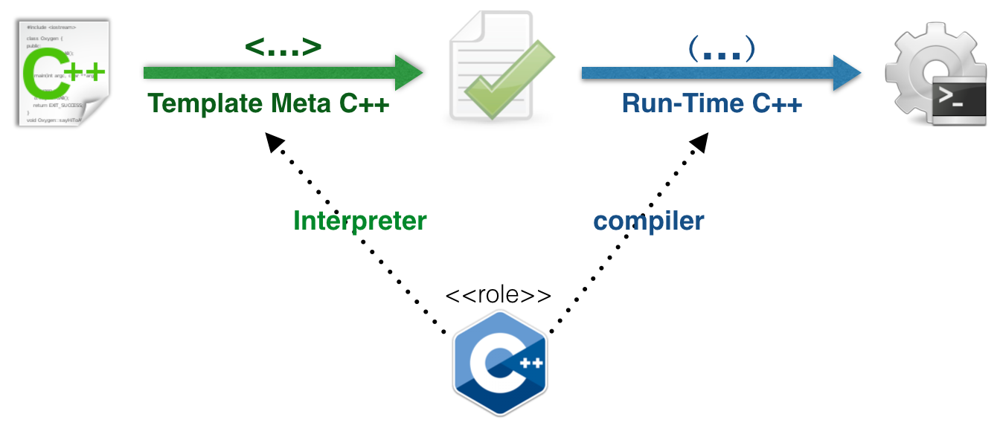
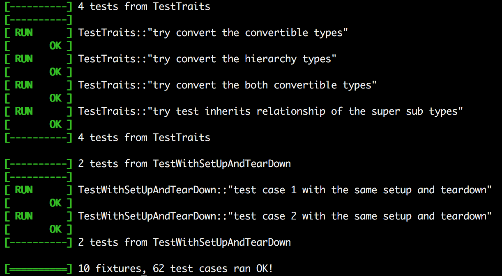
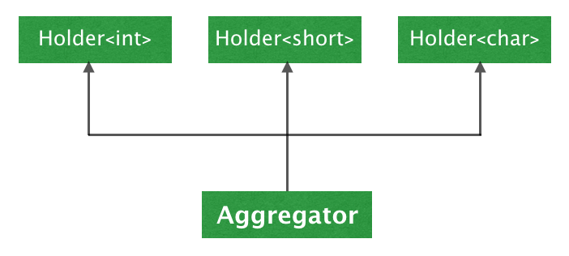
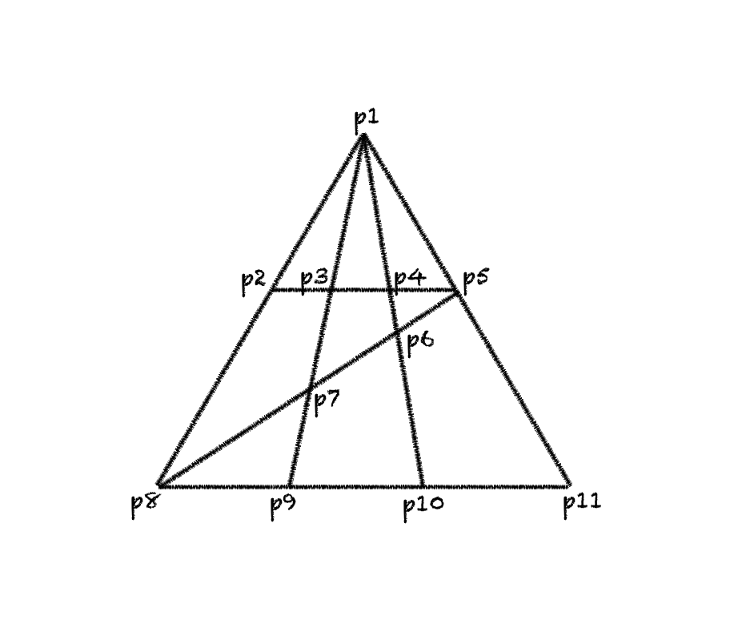
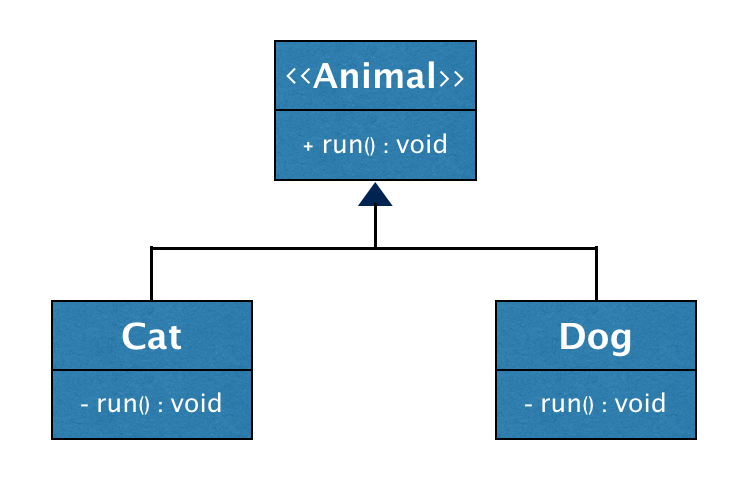
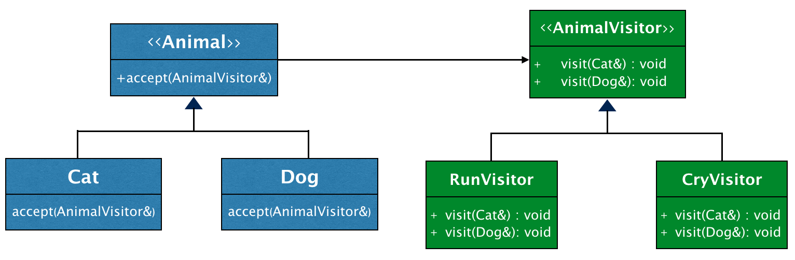

# TLP: learning template meta programming by C++11

[toc]

## 前言

熟悉C\++的程序员都知道，C\++是一门多范式编程语言，支持面向过程、面向对象、泛型编程以及函数式编程范式。然而提到C\++模板元编程，在很多人心里这却似乎是C\++里的一种黑魔法：它很难学习，一旦进入这个领域曾经那些熟悉的东西（if，for...）都不再灵验；它很强大，但现实中却鲜见有人用它来解决实际问题，除过偶尔在一些编码练习中被某些C\++狂热粉当做奇淫巧技拿出来秀秀肌肉。

其实模板元编程是C\++所支持的一种非常强大的计算能力，它是使用C\++开发高质量库和框架所离不开的一项武器。

掌握C\++模板元编程，可以帮助你做到：

- 实现高扩展性，并且兼具高性能的库
- 实现更加灵活且易于使用的框架
- 实现基于C\++的内部DSL（Domain Special Language）
- 帮助更好地理解并使用模板和泛型编程，更深入地使用C\++ STL库的一些高级特性

如果你是一个C\++的库或框架的开发者，了解和掌握一些模板元编程的知识，可能会让你的作品更易于扩展、拥有更易用的接口，甚至更高的运行时效率。而即使你只使用C\++设计和开发应用程序，了解模板元编程也会帮助你更好的去使用STL库的各种特性，甚至帮助你的局部设计做的更加漂亮。

实际上C\++模板元编程技术已经渗透在我们日常使用的各种库和框架中，例如STL库以及各种xUnit测试框架和mock框架。可以说，模板元编程是中级C\++程序员迈向高级的必经之路！

然而现实是，C\++模板元编程的学习之旅却并不平坦。

一方面，由于C\++模板元编程的本质是函数式编程，熟练掌握并使用函数式编程的程序员比较小众，绝大多数程序员初次进入这个领域时面对模式匹配、递归和不可变性时都会手足无措。另一方面，由于C\++的模板元编程能力是被意外发现的，不像别的函数式编程语言经过良好的设计，所以C\++的这种函数式计算能力天生存在着各种缺陷，直到C\++11标准才开始逐渐完善起来。在之前很多重要特性都要靠很绕的方式去迂回实现，增加了学习的难度。

另外，市面上介绍模板元编程的书和资料也乏善可陈，以下的书相对还不错，但对于模板元编程的介绍仍旧存在一些问题：

- 《C\++ Templates Complete》
	介绍C++模板知识最全面的一本书，涉及到了模板各个方面的基础知识和应用技巧。由于元编程并不是此书重点，所以仅有短短一章列举了一些利用模板元编程做数值计算的例子。现实中模板元编程很少用来做数值计算，更多被用来做类型计算和代码生成，书中却涉及甚少。

- 《Modern C\++ Design》
	介绍如何使用模板进行C\++高阶设计的一本书。介绍了`TypeLists`的概念，作为一种重要的编译时数据结构，是元编程的基础。但遗憾作者并没有显示的提出元编程的概念，也没有对C\++编译时运算特征进行总结和提炼。最后由于此书基于的C\++ 98标准对于模板以及编译期类型计算支持上的欠缺，书中介绍的不少实现比较迂回复杂。

- 《C\++模板元编程》
	正式介绍C\++模板元编程的一本书，引入了元函数的概念，对基于模板的函数式计算进行了规范化，发挥了编译期元函数可组合的优势。遗憾的是，此书只能算是boost中模板元编程库（mpl）的用户手册，基本上是在讲mpl库的用户接口和使用方法，没有涉及库的实现细节。现实中我们采用元编程解决问题，一般不会引用boost这么重的库，往往只会在某一局部借鉴类似的设计技巧。所以对于元编程来说，授之以渔的意义远大于授之以鱼。另外由于boost mpl库中用了大量C\++预处理期代码生成技术，导致想通过看mpl的源码掌握模板元编程的人基本是会陷入到一堆宏中，对于学习元编程增加了非常多的干扰因素。

基于以上原因，我使用C\++11实现了一个C\++模板元编程的库：[TLP ](https://github.com/MagicBowen/tlp)[(https://github.com/MagicBowen/tlp)]()，然后再通过这一系列文章结合TLP库中的代码示例来为大家介绍C\++模板元编程的各方面知识。

TLP库包含以下内容：

- 基本的编译期数据类型和算法；
- 基本的编译期数据结构TypeList，以及针对它的各种基本算法函数：length、append、erase、replace、unique、belong、comb...
- 基于TypeList的各种高阶函数，如 any，all，sort、transform、map，filter，fold...
- 进行模板元编程的常用辅助函数，如 IsEqual，IfThenElse，Print...
- 一些有用的编译期Traits工具；
- 进行编译期函数定义的各种辅助工具；
- 一个面向模板元编程的测试框架，所有的测试用例执行在C\++的编译期，我们使用它来对TLP进行测试；

除此之外，TLP库中还包含了如下演示如何在现实中使用TLP库进行模板元编程的示例代码，分别是：

- 示范了如何使用模板元编程做纯编译期计算，完成一个自动数三角形的程序；
- 示范了如何使用模板元编程技术来实现代码生成，自动创建visitor设计模式；
- 示范了如何使用模板元编程技术来实现一个DSL，用于描述并生成有限状态机；

上面提到的TypeList以及使用代码生成来创建visitor设计模式的原创者是《Modern C\++ Design》的作者Andrei Alexandrescu。在TLP中我用C\++11对TypeList及其算法进行了改写，并进行了高阶函数的扩展。得益于C\++11标准对模板元编程的更好支持，新的实现比起原来的更加清晰和简洁。

示例代码中利用模板元编程创建有限状态机DSL的例子来自于《C++模板元编程》一书，为了更好的展示其实现，我用TypeList对其进行了改写。

除了上面的例子，本文还介绍了我自己开发的面向C\++模块或子系统级别的FT（Functional Test）测试框架[dates](https://github.com/MagicBowen/dates)，重点展示了它如何使用模板元编程来进行类型萃取、类型选择以及类型校验，最终使得框架变得更易用、更高效以及更安全。这些技巧可以帮助到大家更好地使用模板元编程去解决现实问题。

最后，TLP库自身的测试通过一个原创的C\++模板元编程测试框架。该框架专门针对C\++编译期计算进行测试，它的用法和常见的xUnit测试框架类似，但有趣的是使用该框架所描述的所有测试用例的执行发生在C\++编译期。本文会专门介绍该框架的一些实现细节。

C\++模板元编程当年被提出来的时候，函数式编程还没有像今天这样被更多的人所了解和接受，当时的C\++标准和编译器对模板和编译期计算的支持也非常有限。然而到了今天，很多事情发生了变化！本文的读者最好能够有一些函数式编程的基础，了解C\++模板的基本用法，熟悉一些C\++11标准的内容。当然文中所有用的到模板技术、C\++11标准和涉及到的函数式编程概念也都会专门介绍和说明。

如果你从来没有接触过C\++模板元编程，那么最好从一开始就把它当做一门全新的语言去学习，从头掌握C\++中这种不一样的计算模型和语法。这种新的语言和我们熟识的运行期C\++的语法和计算模型有很大的差异，但它的优势在于能和运行期C\++紧密无缝地结合在一起，无论是在提高程序可扩展性还是提高程序运行效率上，都能创造出非常不可思议的效果来。希望通过这篇文章，可以让更多的人掌握C\++模板元编程这一设计利器，在适合的场合下以更有效、更酷的方式去解决问题。

> 本文中出现的代码片段，如果在注释中给出了TLP库中对应文件路径，则都是TLP库中的源码，其它的都是为了文章需要所构造的临时代码。另外，为了减少噪音，文中所示TLP库中的代码均没有加命名空间，阅读文章和TLP库源码时请注意区分。

## 模板的基本知识

模板元编程中的主要技术工具就是模板。模板最开始作为一种更加安全的宏被引入C\++，用来解决代码在不同类型间复用的问题。后来随着人们的使用，模板强大的编译期计算能力被挖掘了出来，同时伴随着标准的演进，模板被赋予的功能也越来越强大！

下面我们以类模板举例，总结一下我们后面会用到的模板知识。

### 模板的类型参数

~~~cpp
#include <vector>
#include <stdexcept>

template<typename T>
struct Stack
{
    void push(const T& elem)
    {
        elems.push_back(elem);
    }

    T pop()
    {
        if(empty()) throw std::out_of_range("Stack<>::pop: empty!");

        auto elem = elems.back();
        elems.pop_back();
        return elem;
    }

    bool empty() const
    {
        return elems.empty();
    }

private:
    std::vector<T> elems;
};
~~~

上面我们用模板类实现了一个简单的容器栈，它可以支持不同的类型做元素。如下：

~~~cpp
Stack<int> intStack;
intStack.push(-1);
intStack.push(2);
intStack.push(-3);
std::cout << intStack.pop() << std::endl;

Stack<char> charStack;
charStack.push('A');
charStack.push('B');
std::cout << charStack.pop() << std::endl;
~~~

可以将类模板想象成一个编译期的函数，不同的是它的参数列表放在一对尖括号中。通过`template<typename T> struct Stack`我们声明了一个编译期的函数，它的名字叫做Stack，它有一个类型形参T。

标准规定可以用typename或者class关键字指示模板形参是一个类型，不能使用struct。由于模板的类型形参不仅可以被替换为用户自定义类型，也可以被替换为内置类型（int, char, double...），所以使用typename语义上比class更清晰一些。本文统一使用typename。

如同把具体的实参传递给一个函数，函数就会计算求值一样，当我们把具体的类型当做实参传递给类模板时，类模板会在编译期进行计算，返回一个具体的类型。类模板的传参和函数类似，只不过语法上使用尖括号。

上例中我们分别将int和char当做实参，传递给类模板Stack。Stack得到实参后变成具体的类型`Stack<int>`和`Stack<char>`。根据运行期C\++的要求，只有具体类型才能产生对象，所以我们分别用`Stack<int>`和`Stack<char>`生成了两个对象`intStack`和`charStack`。

类模板的实现中可以继续使用类模板。上例中Stack的实现中使用了标准库中的类模板`std::vector`。一旦我们在Stack中用具体类型替换形参T，`std::vector<T>`也会被传递参数从而变成一个具体类型，使得可以产生`elems`对象。

上面虽然我们用编译期函数来类比类模板，但是这时的类模板还远未达到模板元编程的要求，我们继续！

### 模板的默认参数

上面例子中，栈的实现使用了std::vector。为了让栈的实现更加灵活，我们将实现栈的容器也作为模板的参数之一。

~~~cpp
template<typename T, typename Container = std::vector<T>>
struct Stack
{
    void push(const T& elem)
    {
        elems.push_back(elem);
    }

    T pop()
    {
        if(empty()) throw std::out_of_range("Stack<>::pop: empty!");

        auto elem = elems.back();
        elems.pop_back();
        return elem;
    }

    bool empty() const
    {
        return elems.empty();
    }

private:
    Container elems;
};
~~~

如上我们为类模板增加了一个类型参数`Container`。和函数类似，模板也支持声明默认参数，这里我们将Container默认设值为`std::vector<T>`。由于在模板的形参声明过程中，后面的声明可以使用前面出现过的形参，我们在`typename Container = std::vector<T>`中使用了T，因此这里`std::vector<T>`仍旧是一个类型。

现在我们还可以像之前一样使用该类模板，当使用`Stack<int>`定义`intStack`时Container使用默认的`std::vector<T>`。同时我们可以显示指定Container为别的容器类，例如`Stack<int, std::deque<int>> intStack;`。

每个用于替换模板形参Container的具体类型，必须满足Stack使用Container时的隐式约束。例如上例中Stack使用了Container的无参构造函数，调用了Container的`push_back`，`back`，`pop_back`，`empty`接口，并且对每个接口的参数和返回值都有一定预期。上面使用的`std::vector<T>`和`std::deque<T>`都满足如上约束。一旦不满足，会出现编译错误。

目前C\++中，模板这种对参数特征的约束只能通过参数被使用的情况隐式推断出来，后续的标准后可能会引进concept的概念对其显示化。

### 模板的模板参数

上例中由于Stack类模板的声明中第二个参数是一个类型（`typename Container`），所以我们通过`Stack<int, std::deque<int>>`定义一个具体的栈类型时，第二个参数传递`std::deque<int>`，而不能是`std::deque`。上述定义中我们一共把int写了两遍，而这种重复是一种必然的重复。

为了避免上述重复，我们可以让Stack的第二个参数直接是一个模板，而不再是一个具体类型。

~~~cpp
template<typename T,
         template<typename> class Container = std::vector>
struct Stack
{
    void push(const T& elem)
    {
        elems.push_back(elem);
    }

    T pop()
    {
        if(empty()) throw std::out_of_range("Stack<>::pop: empty!");

        auto elem = elems.back();
        elems.pop_back();
        return elem;
    }

    bool empty() const
    {
        return elems.empty();
    }

private:
    Container<T> elems;
};
~~~

如上Stack类模板的第二个参数变为`template<typename> class Container`，它的名字仍旧是Container，但是类型变为一个模板，这个模板具有一个类型参数。由于Container自身的模板形参名字没有被使用，所以我们可以省略。按照标准这里声明Container前的关键字只能是class，不能是typename。最后，模板的模板参数也可以有默认值，这里我们设置为`std::vector`。

有了上面的定义，我们期望可以这样使用Stack：`Stack<int, std::deque> intStack`，但编译器却给了我们一个教训。

std::deque类模板在stl库中的定义有两个类型参数，第一个参数是元素类型，第二个参数是分配器allocator的类型。虽然std::deque的第二个类型参数有默认值，但是当编译器使用std::deque替换Container时却会严格匹配参数，默认值被忽略了。

我们修改Stack的定义如下：

~~~cpp
template<typename T,
         template<typename Elem, typename Allocator = std::allocator<Elem>> class Container = std::vector>
struct Stack
{
    void push(const T& elem)
    {
        elems.push_back(elem);
    }

    T pop()
    {
        if(empty()) throw std::out_of_range("Stack<>::pop: empty!");

        auto elem = elems.back();
        elems.pop_back();
        return elem;
    }

    bool empty() const
    {
        return elems.empty();
    }

private:
    Container<T> elems;
};
~~~

现在`Stack<int, std::deque> intStack`可以编译通过了！

可以看到模板的模板参数特性，可以让类模板之间通过模板参数互相组合。如果我们将类模板比作C\++编译期的函数，那么可以接受模板作为参数的类模板，就相当于一个函数的入参仍旧可以是函数，这是后面我们会介绍到的高阶函数的概念。

### 模板的特化

前面定义的Stack中，第二个模板参数要求支持`back`，`push_back`，`pop_back`等接口。如果我们已经有一个自定义的容器`Array`，它的定义如下：

~~~cpp
template<typename T, typename Allocator = std::allocator<T>>
struct Array
{
    void put(size_t index, const T& t)；
    T get(size_t index)；
    ...
};
~~~

Array只有put和get接口，并辅助以index参数进行元素存取。为了让Array也能参与实现Stack，我们可以对Stack进行特化，当Stack的第二个参数是Array时重新定义Stack的实现：

~~~cpp
template<typename T>
struct Stack<T, Array>
{
    Stack() : size(0)
    {
    }

    void push(const T& elem)
    {
        elems.put(size++, elem);
    }

    T pop()
    {
        if(empty()) throw std::out_of_range("Stack<>::pop: empty!");
        return elems.get(--size);
    }

    bool empty() const
    {
        return size == 0;
    }

private:
    size_t size;
    Array<T> elems;
};
~~~

在Stack特化版本的声明`template<typename T> struct Stack<T, Array>`中，Stack名字后面的尖括号中`Stack<T, Array>`传递的参数可以是具体类型，也可以不是具体类型，但是至少要比Stack主模板（非特化版本）的参数更加特殊一些，而且和主模板的参数声明顺序和约束必须一致。

如果特化版本中，所有的模板参数都被替换成了具体类型，那么就叫做**全特化**，例如：

~~~cpp
template<> 
struct Stack<int*, Array>
{
	...
};
~~~

如果参数中还有非具体类型，那么就叫做**部分特化**或者**偏特化**，例如：

~~~cpp
template<typename T>
struct Stack<T, Array>
{
	...
}；
~~~

无论是全特化还是偏特化，特化版本的声明仍然需要使用关键字template，后面紧跟的尖括号中声明特化版本中还在使用的非具体类型形参。由于全特化不再存在非具体类型，所以尖括号中为空，但是不能省略，皆以`template <>`开头。

注意，主模板的template关键字后面定义了该模板的基本原型特征，特化模板的**模板名称关键字后面的尖括号**中的模板参数必须和**主模板template关键字后面尖括号**中的参数顺序和约束一致。上例中由于主模板声明第一个模板参数是类型，第二个模板参数是模板，所以特化版本`Stack<T, Array>`尖括号中的参数不能多也不能少，且顺序不能颠倒，而且第二个参数模板Array的定义必须和主模板中对Container的模板约束一致。

特化版本的template后面紧跟的尖括号中仅是声明特化版本中还在使用的非具体类型参数，和主模板template后面紧跟的尖括号中的参数没有任何关系。

上例中，我们修改了`Stack<T, Array>`中`push`、`pop`、`empty`成员方法的实现，并且增加了`size`数据成员。我们甚至还可以修改`Stack<T, Array>`中的接口名称，不再叫push和pop，或者删掉empty的实现，只要`Stack<T, Array>`的客户正确地使用该特化版本的接口即可。可见对于模板的特化，只需要其签名（模板名和模板参数）和主模板保持一致，而对于其实现，和主模板以及其它特化版本的实现没有任何关系，完全可以根据该特化版本的需要进行定制。

当我们给一个模板传递参数后，编译器会从主模板和所有的特化版本的实现中进行选择，简单来说选择的规则和函数重载的选择顺序类似，就是选择最多匹配的那个版本。

如上例中如论是`Stack<int, Array>`还是`Stack<double, Array>`都会匹配`template<typename T> struct Stack<T, Array>`版本的实现，而`Stack<int, std::list>`则会匹配主模板的实现。

关于特化最后再提一个我们后面会用到的知识点，那就是模板可以被嵌套地定义在一个类中或模板中，但是模板的特化不可以。

### 模板的非类型参数

前面的例子中，我们分别使用了类型和模板作为类模板的参数。除此之外，模板还支持其它非类型模板参数。

如下用数组实现Stack模板，第二个模板参数是一个int型常量，用于定义数组的最大长度。

~~~cpp
template<typename T, int MAX_SIZE>
struct Stack
{
	void push(const T&);
    T pop();
    
private:
	T elems[MAX_SIZE];
    int size;
};
~~~

一般来说，模板的非类型参数只能是整型常量（包括enum），或者指向外部链接的指针（包括函数指针，类的成员函数指针）。到目前为止还不支持浮点数，对于字符串常量也不支持，但是可以支持具有外部链接的字符串常量指针。

例如对于下面的模板定义：

~~~cpp
template<const char* MyName>
struct Token
{
    std::string name{MyName};
};
~~~

下面的用法都产生编译错误：

~~~cpp
	Token<“Hello”> tocken；
~~~

~~~cpp
    const char* str = "Hello";
    Token<str> tocken;
~~~

而如下是可以正确编译通过的：

~~~cpp
extern const char str[] = "Hello";

Token<str> token;
std::cout << tocken.name << std::endl;
~~~

总结一下，模板的参数支持以下类型：

- 类型参数；
	使用typename或者class指示。

- 非类型参数；
	整型常量（包括enum），或者指向外部链接的指针（包括函数指针、类的成员函数指针，以及具有外部链接的字符串常量指针）。

- 模板参数；
	使用`template<...> class XXX`的形式指示。

### 模板的编译期计算

和函数求值类似，当模板的形参被实参替换时，模板会进行编译期计算。由于模板的参数支持类型参数和非类型参数，所以模板在编译期可以进行两类计算：类型计算和数值计算。

#### 数值计算

模板的数值计算发生在编译期，计算的参数一般由模板参数输入，计算的结果由模板内部定义的enum或者static const的整形成员保存。

如下我们实现编译期的整数加法：

~~~cpp
template<int X, int Y>
struct Plus
{
    enum { Value = X + Y };
};
~~~

如下我们使用这个类模板进行加法运算：

~~~cpp
int main()
{
	std::cout << Plus<3, 4>::Value << std::endl;
    return 0;
}
~~~

上面代码会打印出7。注意这里对7的计算发生在编译期，当我们在main函数中打印的时候结果其实已经是计算好了的。

为了验证我们的说法，我们想办法让结果在C\++的编译过程中就打印出来。

~~~cpp
template<int Value>
struct Print
{
    operator char()
    {
        return Value + 0xFF; // INVOKE OVERFLOW WARNNING LOG !
    }
};

#define __print(token, ...) char print_value_##tocken = Print<__VA_ARGS__>()
~~~

由于C\++的编译期计算无法直接操作IO，我们只能想办法通过C\++的编译器将计算结果在编译信息中打印出来。如上`__print`宏定义中将一个`Print<Value>`的对象赋值给一个临时的char变量，从而导致调用Print中定义的char类型隐式转换函数`operator char()`。该隐式转换函数中将Value和0xFF进行相加，这将会导致编译器会产生一个char类型值溢出告警，从而将Value的值打印出来。

我们这时可以删除main函数，然后在任一cpp文件中包含上述Plus和Print模板的头文件，然后写下如下语句

~~~cpp
// TestPrint.cpp
// should include the header files of Plus and Print
__print(Plus_3_4, Plus<3, 4>::Value);
~~~

在gcc4.8.4上，编译器编译到该文件时打印如下：

~~~bash
TestPrint.cpp: In instantiation of 'Print<Value>::operator char()[with int value = 7]'：
TestPrint.cpp: required form here
TestPrint.cpp: warning: overflow in implicit constant conversion [-Woverflow]
~~~

可以看到计算结果是在编译告警`Print<Value>::operator char()[with int value = 7]`中打印出来的。

由于一个文件中`__print`可能会被使用多次，所以它的第一个参数token是为了让每个临时的char变量的名字不重复。我们可以优化`__print`的定义，避免让用户传递一个token，而让编译器帮我们产生一个不会重复的名字。如下：

~~~cpp
#define __print(...) char UNIQUE_NAME(print_value_) = Print<__VA_ARGS__>()
~~~

我们使用了`UNIQUE_NAME`宏来为临时的char变量产生不重复的名字，`UNIQUE_NAME`的定义如下。这里使用了一个小技巧，将当前行号拼接到一个固定的token中产生了一个不重复的名字。

~~~cpp
#define __DO_JOIN(symbol1, symbol2) symbol1##symbol2
#define _JOIN(symbol1, symbol2) __DO_JOIN(symbol1, symbol2)

# define UNIQUE_NAME(prefix) _JOIN(prefix, __LINE__)
~~~

现在我们可以这样使用`__print`了：`__print(Plus<3, 4>::Value);`。

对于类模板Plus我们可以这样理解：它就如同一个函数，`Plus`是函数名，它声明需要两个int型的入参，分别是形参`X`和`Y`。它的返回值是内部定义的`Value`。对它的调用方式是`Plus<3, 4>::Value`，尖括号中传递实参，通过调用`Value`获得计算结果。只不过这个函数的计算发生在C\++编译期，为了和运行期函数进行区分，编译期的函数都用尖括号而非圆括号。

C\++这种编译期的函数其实是支持多返回值的，例如我们修改上例的代码，一次计算出整数加减乘除的所有结果。

~~~cpp
template<int X, int Y>
struct Caculate
{
    enum
    {
        Sum = X + Y,
        Dec = X - Y,
        Mul = X * Y,
        Div = X / Y
    };
};
~~~

可以使用`Caculate<10, 2>::Sum`，`Caculate<10, 2>::Dec`，`Caculate<10, 2>::Mul`，`Caculate<10, 2>::Div`分别获得10和2的加减乘除的结果。

这种多返回值计算在我们后续介绍元编程时使用的并不多。原因之一是当我们只想要其中一个计算结果时，所有的结果其实是一起被计算了，会存在额外的计算开销。另外一个重要的原因是，多个返回值必须每个的名字都不一样，这样就对我们后续介绍编译期的函数组合能力造成障碍。

除了用enum保存编译期的数值计算结果，还可以用 static const成员变量。上面例子修改如下效果一样。

~~~cpp
template<int X, int Y>
struct Plus
{
    static const int Value = X + Y;
};
~~~

由于有些编译器对static const在模板的计算中存在问题，需要为其分配内存，所以本文对于编译期数值计算结果的保存一律使用enum。

#### 类型计算

除了可以计算数值，编译期更具有价值的是类型计算。我们可以将编译期常量和类型都看做是编译期的可计算对象。

我们知道模板的所有形参被实参替换后，模板自身就具现化为一个具体的类型了。但是模板自身具现化的这个类型对于我们想要的编译期类型计算来说缺少抽象能力。模板的类型计算结果一般保存在模板内部定义的嵌套类型中。

模板内部定义类型的方法除了可以直接在模板内部定义嵌套类，更多的是使用typedef。

如下我们定义了一个类模板，它的入参是类型T，内部通过Type定义了T的指针类型`T*`。

~~~cpp
template<typename T>
struct PointerOf
{
    typedef T* Type;
};
~~~

我们可以像下面这样使用该模板：

~~~cpp
PointerOf<const char>::Type s = "Hello world!";
std::cout << s << std::endl;
~~~

如同前面数值计算一样，我们可以这样理解`PointerOf`：`PointerOf`是一个编译期的函数，它使用`<typename T>`声明了它有一个类型形参T。我们通过访问`Type`可以获得该函数的返回值，也是一个类型。这个函数负责在C\++编译期将一个输入类型转变为它对应的指针类型。所以调用`PointerOf<const char>::Type`其实是和`const char *`本质上一样。

我们定义的这个`PointerOf`似乎有些无聊，但这却是类型计算的基础。后面当我们把这种类型计算的小函数组合起来，会逐渐看到它们的威力。

最后，C\++11标准使用using关键字来专门定义类型别名，它的用法和定义变量的习惯类似，且后面会看到功能也比typedef强大得多，所以我们后续类型计算统一用using关键字定义类型别名。`PointerOf`的定义修改如下：

~~~cpp
template<typename T>
struct PointerOf
{
	using Type = T*;
};
~~~

### 模板递归

模板可以被递归调用，在模板递归的过程中，可以执行前面我们提到的两种编译期计算：数值计算和类型计算。

下面我们用模板递归来做数值计算，在编译期计算N的阶乘。

~~~cpp
template<int N>
struct Factorial
{
    enum { Value = N * Factorial<N - 1>::Value };
};

template<>
struct Factorial<1>
{
    enum { Value = 1 };
};

~~~

可以看到，我们在主模板`template<int N> struct Factorial`的定义中，使用了模板自身`Factorial<N - 1>::Value`。编译器会一直用不同的`N - 1`的值来具现化主模板，一直到N变为1，这时选择Factorial的特化版本`template<> struct Factorial<1>`，内部的Value变为1，递归终止了。

我们可以在编译期运行这个函数`__print(Factorial<5>::Value)`，可以看到编译器会打印出120。

对于上面的例子，我们看到是通过模板特化来终止递归的。事实上我们对比一下Haskell语言中计算阶乘的函数实现：

~~~haskell
factorial :: Int -> Int
factorial n = n * factorial (n - 1)
factorial 1 = 1
~~~

Haskell是一门纯函数式语言，它通过模式匹配还进行条件选择，通过递归来进行循环控制。对于上面的factorial定义，当入参是1的时候模式匹配会选择到`factorial 1 = 1`实现，否则匹配到`factorial n = n * factorial (n - 1)`的递归实现。

可以看到上面我们使用C\++中模板的方式和Haskell中定义的函数是如此的类似。编译器对模板的特化版本选择就相当是Haskell在做模式匹配，而两者的循环控制都是通过递归来完成。已经证明模板的这种编译时计算能力就是一种纯函数式编程范式，是图灵完备的！

不同的是，C\++这种编译时计算支持的计算对象主要是整形和类型。

C\++这种编译期函数式计算就是本文要介绍的C\++模板元编程，类模板在里面充当了函数的角色。本文用到的关于类模板所有知识基本就是前文所述这些。后面我们将会对类模板进行规范化，让其能够和函数式计算更加地一致，最大程度发挥编译期函数式计算的威力。

## C\++模板元编程

从本节开始我们将模板元编程当做一门独立的函数式语言来讨论它的方方面面。

对于一个函数式编程语言，函数是它的第一等公民。所以对于模板元编程，我们首先需要定义出这门语言中的函数形态，然后基于函数讨论它的主要特征。

### 元函数

我们通过继续演进前面那个无聊的类型计算的例子，来得出元函数的定义。

前面我们实现了PointerOf，它对于传进的任意类型T可以计算出T的指针类型。

~~~cpp
template<typename T>
struct PointerOf
{
	using Result = T*;
};
~~~

现在我们想要实现一个能够计算T的指针的指针类型的模板，怎么做？

一种做法是直接定义一个新的模板：

~~~cpp
template<typename T>
struct Pointer2Of
{
	using Result = T**;
};
~~~

为了让类型计算结果更像是出自函数的返回值，我们将计算结果的类型别名后续统一叫做`Result`。上述类模板本质上是一个对类型进行计算的函数:

> `Pointer2Of :: (typename T) => T -> T**`

可以这样使用该函数：

~~~cpp
int* pi;
Pointer2Of<int>::Result ppi = &pi;
~~~

上述代码中`Pointer2Of<int>::Result`的计算发生在编译期，当在C\++运行期前它已经得到计算结果`int**`了。所以上述代码在编译器计算完成后，就相当于如下代码：

~~~cpp
int* pi;
int** ppi = &pi;
~~~

虽然我们把类模板当做编译期函数来看，但是这种函数语法看起来和我们熟悉的函数相差较大，但究其本质和函数调用并无差异，都是为函数传入符合要求的实参，获得函数返回结果。

我们可以认为由于圆括号已经优先给了运行时C\++函数，所以这种编译期C\++函数的定义和调用都使用尖括号，并且需要显示调用Result才对函数进行运算求值。当使用这种编译期函数但并不调用Result时，可以将其类比为在运行期C\++中使用一个函数指针，仅做传递用，但并不求值。

编译期函数计算，可以调用已有的其它编译期函数。如下通过嵌套调用PointerOf，也可以实现Pointer2Of：

~~~cpp
template<typename T>
struct Pointer2Of
{
	using Result = typename PointerOf<typename PointerOf<T>::Result>::Result;
};
~~~

上面我们通过嵌套调用两次PointerOf来完成Pointer2Of的实现。在Pointer2Of中我们每次使用`PointerOf<...>::Result`时前面都用了typename关键字。原因是C\++标准要求一旦PointerOf后面的尖括号中存在非具体类型的话，那么使用`::`访问PointerOf的内部类型Result时必须使用typename显示指明`PointerOf<...>::Result`是一个类型。所以我们在Pointer2Of中使用PointerOf完整的方式是这样的：`typename PointerOf<...>::Result`。

和Haskell相比，我们必须得承认C\++的这种函数式编程的书写确实太繁琐了。为了简化对元函数的使用，我们可以用宏封装一下PointerOf：

~~~cpp
#define __pointer(...) typename PointerOf<__VA_ARGS__>::Result
~~~

这样Pointer2Of的定义可以简化如下：

~~~cpp
template<typename T>
struct Pointer2Of
{
	using Result = __pointer(__pointer(T));
};
~~~

现在看起来好多了，`__pointer(T)`的写法更像是在调用一个函数。

可以看到我们对类模板进行约束，固定用Result保存计算结果，且只返回单一结果，可以使我们将模板当做函数使用时的写法得到统一，这对于我们进行函数组合简直是必须的。

后续我们将一直把这种在编译期进行计算，靠Result返回计算结果的类模板看作是编译期的函数，它的目的是为了支持C\++模板元编程。为了和C\++运行时函数进行区分，后文中我们统一将其称作**元函数**。

如同函数是函数式编程的构成基础一样，元函数是C\++模板元编程的构成基础。

### 高阶函数

接着上面的例子，此刻我们想要定义指向指针的指针的指针的指针类型，怎么办？或者说我们想要一种能够任意指定指针层数的元函数。

我们手里已经有了一个PointerOf元函数，我们需要一个能够将其对一个指定类型反复施展指定次数的元函数。

下面我们实现了一个通用的Times元函数，它可以对一个指定类型T反复调用另一个元函数N次。

~~~cpp
template<int N, typename T, template<typename> class Func>
struct Times
{
    using Result = typename Func<typename Times<N - 1, T, Func>::Result>::Result;
};

template<typename T, template<typename> class Func>
struct Times<1, T, Func>
{
    using Result = typename Func<T>::Result;
};
~~~

上面的代码中，Times有三个参数，第一个参数是次数N，第二个参数是类型T，第三个参数是可以接收一个类型参数的元函数Func。Times采用了递归实现，当N为1时，Result就是元函数Func的结果，否则就递归调用`Func<typename Times<N - 1, T, Func>::Result>::Result`。

最后我们通过组合两个元函数，实现了计算指定类型的四层指针类型，如下：

~~~cpp
int*** pppi;
Times<4, int, PointerOf>::Result ppppi = &pppi;
~~~

上面的Times元函数是一个可以接收一个元函数做参数的元函数，在函数式编程里面这称作**高阶函数**。高阶函数可以让代码在更高的抽象层次上进行组合复用。

比如我们同样可以可以将Pointer2Of和Times组合起来，实现四重指针类型计算：

~~~cpp
int*** pppi;
Times<2, int, Pointer2Of>::Result ppppi = &pppi;
~~~

事实上有了Times元函数，我们可以轻易得到任意层数的指针类型。

~~~cpp
using Pointer3OfInt = typename Times<3, int, PointerOf>::Result;

int** ppi;
Pointer3OfInt pppi = &ppi;
~~~

高阶函数除了允许函数的参数是函数，还允许函数的返回值也是函数。对于C\++，我们利用可以在类或者模板里面嵌套定义模板的特性，来实现元函数的返回值是元函数。

~~~cpp
template<typename T>
struct OuterFunc
{
	template<typename U, typename V>
    struct Result
    {
    	// ...
    }；
};
~~~

如上我们定义了一个单参元函数`OuterFunc`，它的返回值是另外一个双参元函数。注意，在调用类或模板内部定义的模板时，标准要求必须使用template关键字。所以我们这样使用OuterFunc的返回值函数：`OuterFunc<int>:: template Result`。

由于C\++标准不允许在类或者模板的内部定义模板的特化，一旦我们定义的内部元函数使用了模板特化，那么就必须定义在外面，再由原来的外层元函数引用。如下：

~~~cpp
template<typename T, typename U>
struct InnerFunc
{
	// 主版本实现
};

template<typename T>
struct InnerFunc<T, T>
{
	// 特化版本实现
};

template<typename T>
struct OuterFunc
{
	template<typename U, typename V>
	using Result = InnerFunc<U, V>;
};
~~~

### 柯理函数（currying）

现在，我们想实现一个元函数，可以固定返回char类型的指定层数的指针类型。

~~~cpp
template<int N>
struct CharPointer
{
	using Result = typename Times<N, char, PointerOf>::Result;
};
~~~

如上，我们定义了元函数CharPointer，它是一个int型单参元函数。它的实现调用了Times，将其第二和第三个参数分别固定为char和PointerOf。

借助于继承的特性，上面的代码可以简化为：

~~~cpp
template<int N>
struct CharPointer ：Times<N, char, PointerOf>
{
};
~~~

这种定义元函数的方式叫做**元函数转发**。

如果借助using关键字，可以实现得更加简单：

~~~cpp
template<int N> using CharPointer = Times<N, char, PointerOf>;
~~~

这里我们直接对Times绑定第二和第三个参数后为其起了别名CharPointer。

在函数式编程里面，有个概念叫做函数柯里化(currying)。是指一个函数接收部分参数后，并不立即求值，而是继续返回另一个函数。

如下Haskell代码定义了一个三数相乘的函数multiThree，它接收三个Int型参数返回它们的乘积：

~~~haskell
multiThree :: Int -> Int -> Int -> Int
multiThree x y z = x * y * z
~~~

当我们将multiThree其中一个参数固定后，它就变成了一个二参函数。

~~~bash
ghci > let multiTwoWithNine = multiThree 9
ghci > multiTwoWithNine 2 3
~~~

我们使用using关键字实现元函数转发，可以达到类似函数柯里化的效果。柯里化可以帮助更容易地复用函数，实现函数之间更低成本且更灵活的组合。

> 函数柯里化在函数式编程语言里的意义非常重要，和C\++模板元编程里面的还是有区别的。例如在Haskell中，可以不用为柯里化函数定义别名，就直接将其作为另一个函数的参数传递，而在C\++模板元编程里目前还做不到。

现在借助柯里化，我们重新实现Pointer2Of如下：

~~~cpp
template<typename T> using Pointer2Of = Times<2, T, PointerOf>;
~~~

可以看到，所谓的Pointer2Of，其实就是把Times的第一个和第三个参数固定后，得到的单参柯里化函数。

### 一切都是类型

下面我们实现一个能够判断两个类型是否相等的元函数：

~~~cpp
template<typename T, typename U>
struct IsEqual
{
    enum {Result = false};
};

template<typename T>
struct IsEqual<T, T>
{
    enum {Result = true};
};
~~~

上面的实现中使用了模式特化，当两个类型相等时，选择下面的特化版本，否则选择非特化版本。

接下来我们实现一个在编译期判断两个整数是否相等的元函数：

~~~cpp
template<int N, int M>
struct IsNumEqual
{
    enum {Result = false};
};

template<int N>
struct IsNumEqual<N, N>
{
    enum {Result = true};
};
~~~

我们看到，判断整数是否相等的元函数的实现和前面对类型进行判断的元函数的实现完全一样，唯独入参类型不同。由于元函数不支持函数重载，所以必须得为这两个元函数起不同的函数名称。

另外，我们之前一直用Result表示返回类型，现在又用它返回数值。这种返回型别上的差异，会让我们在函数组合的时候碰到不少问题。

如果我们能有一个方法，让所有的元函数的入参的型别和返回值型别都能一致化，那将对元函数的复用和组合带来极大的好处。

有一个办法可以让我们把数值也变成一个类型。

~~~cpp
// “tlp/int/IntType.h”

template<int V>
struct IntType
{
    enum { Value = V };
    using Result = IntType<V>;
};
~~~

有了IntType，我们可以让每个整形数字都成为不同的类型，例如`IntType<3>`和`IntType<4>`就是不同的类型。虽然可以使用`IntType<3>::Value`获得它的数值，但在模板元编程中我们更倾向使用这种对数值封装过后的类型，因为这样可以让模板元编程的计算对象统一成一种：**只有类型**！

同理，对于bool值，也如此封装：

~~~cpp
// “tlp/bool/BoolType.h”

template<bool V> struct BoolType;

template<>
struct BoolType<true>
{
    enum { Value = true };
    using Result = BoolType<true>;
};

template<>
struct BoolType<false>
{
    enum { Value = false };
    using Result = BoolType<false>;
};

using TrueType = BoolType<true>;
using FalseType = BoolType<false>;
~~~

用了该技术后，后续所有元函数的入参和返回值都只面向类型，再没有数值。如此归一化后，将会从根本上避免由于元编程的操作对象不一致造成的写法上的重复，进一步让元函数的组合能力变得更强。

得益于上述统一，IsEqual只需要如下一份实现就够了：

~~~cpp
// “tlp/bool/algo/IsEqual.h”

template<typename T, typename U>
struct IsEqual
{
    using Result = FalseType;
};

template<typename T>
struct IsEqual<T, T>
{
    using Result = TrueType;
};
~~~

前面我们实现过一个Print模板，用于在编译过程中打印常量的值。现在一切都是类型，我们对Print的实现进行修改，让其可以在编译期打印出类型结果的值。

~~~cpp
// “tlp/test/details/Print.h”

template <typename T>
struct Print
{
    const int Value = 1 / (sizeof(T) - sizeof(T));
};

#define __print(...) Print<__VA_ARGS__> UNIQUE_NAME(tlp_print_)
~~~

现在Print的入参变为一个类型T，使用`__print(T)`会导致一个编译器的告警，输出T的具体类型。`__print()`在输出前会先对其参数进行求值。

~~~cpp
// TestPrint.cpp

__print(IsEqual<IntType<5>, IntType<6>>::Result);
__print(IsEqual<TrueType, BoolType<true>>::Result);
~~~

上面的cpp文件在我的编译环境中输出的告警信息中包含如下内容，其中携带着对`__print()`的参数的求值结果。

~~~bash
TestPrint.cpp : in instantiation of default member initializer Print<BoolType<false> >::Value' required here
...
TestPrint.cpp : in instantiation of default member initializer Print<BoolType<true> >::Value' required here
~~~

可见`IsEqual<IntType<5>, IntType<6>>::Result`的值是`BoolType<false>`，而`IsEqual<TrueType, BoolType<true>>::Result`的值是`BoolType<true>`。

得益于我们将元编程的计算统一到类型上，我们得到了一个统一的Print元函数。

### 一切都是函数

前面我们对整形和bool提供了模板包装，可以将一个具体的值变为一个类型。例如`IntType<5>`和`IntType<6>`就是两个不同的类型，而`BoolType<true>`和`TrueType`则是相同的类型。

从另一个角度来看IntType，它其实也是个元函数：接收一个int型常量，返回一个类型。BoolType也是一样的。为了简化对它们的使用，我们使用宏将其封装一下：

~~~cpp
#define __int(value)    typename IntType<value>::Result
~~~

~~~cpp
#define __bool(...)    typename BoolType<__VA_ARGS__>::Result
#define __true()       typename TrueType::Result
#define __false()      typename FalseType::Result
~~~

后续我们可以如此使用：`__int(5)`，`__int(6)`，`__bool(true)`，`__true()`，`__false()`，这样的用法看起来更像是函数。事实上，你即可以认为它们是类型，也可以认为它们都是一些创建型函数，其中`__true()`和`__false()`比较特殊，没有参数而已。

由于IsEqual也比较常用，所以我们将其也用宏封装一下：

~~~cpp
#define __is_eq(...)   typename IsEqual<__VA_ARGS__>::Result
~~~

如此前面的打印代码，就可以简化如下：

~~~cpp
// TestPrint.cpp

__print(__is_eq(__int(5), __int(6)));
__print(__is_eq(__true(), __bool(true)));
~~~

现在可以看到，构成整个计算的似乎都是函数。其实所有的类型都可以看作是函数，你可以将其想成是一个个创建函数，无非大多数都非常简单不需要参数而已。反过来所有的函数也都可以被看成是类型，当得到入参后，函数就变成其返回值对应的类型。

> 如此看待程序的方式非常的有意义，《计算机程序的构造与解释》一书里面有一章专门提到这个思想，比这里更加的深邃和彻底。这种观点背后产生的设计思想非常的有用。例如对于运行期C++中的一个函数，我们认为它是一个对数据进行操作的过程，然而当我们把这个函数的指针进行保存和传递的时候，它又变成了数据。如此我们就可以把一段计算方式进行存储和转移，在想要的时机再进行运算求值。在OO中，我们熟知的Command设计模式就是这个思路。

有的时候，我们可能需要获得某个IntType或者BoolType里面的实际数值，所以在IntType和BoolType的定义中，仍然存在一个enum值`Value`。虽然我们可以像这样`__int(5)::Value`获得其内部数值，但是这样的用法和我们的元编程规范是不一致的！我们可以实现一个Value元函数，专门用来对类型求值。

~~~cpp
// “tlp/base/algo/Value.h”

template<typename T>
struct Value
{
    enum { Result = T::Value };
};

#define __value(...)    Value<__VA_ARGS__>::Result
~~~

Value元函数是整个TLP库中仅有的一个用Result表示非类型的元函数，它一般使用在一个元编程表达式的最后，对整个表达式进行求值后将值传递给运行期C\++，所以不会对元函数的组合造成问题。

由于我们在IntType和BoolType中定义了内部enum成员Value，所以可以直接对其调用Value元函数：

~~~cpp
std::cout << __value(__int(5)) + __value(__int(6)) << std::endl;
std::cout << __value(__true()) && __value(__bool(false)) << std::endl;
~~~

上面我们使用Value元函数在编译期对IntType和BoolType进行求值，然后在运行期进行数值的相加计算和bool的逻辑与计算，将结果输出。

能否直接就在编译期就对IntType进行数值运算，对BoolType进行逻辑运算呢？可以，定义针对IntType和BoolType专门的运算元函数即可。

如下我们定义IntType的加法运算元函数，它接收两个IntType类型做入参，返回一个新的IntType，其Value是两个入参IntType的Value之和。

~~~cpp
// “tlp/int/algo/Add.h”

template<typename T1, typename T2> struct Add;

template<int V1, int V2>
struct Add<IntType<V1>, IntType<V2>>
{
    using Result = IntType<V1 + V2>;
};

#define __add(...)    typename Add<__VA_ARGS__>::Result
~~~

我们可以在编译期打印出计算结果来：`__print(__add(__int(5), __int(6)))`。

类似地，在TLP库中针对IntType定义了如下基本运算元函数：

- `__inc()` : 递增运算。例如 `__inc(__int(5))`的结果是`__int(6)`;
- `__dec()` : 递减运算。例如 `__dec(__int(5))`的结果是`__int(4)`;
- `__add()` : 加法运算。例如 `__add(__int(5), __int(2))`的结果是`__int(7)`;
- `__sub()` : 减法运算。例如 `__sub(__int(5), __int(2))`的结果是`__int(3)`;
- `__mul()` : 乘法运算。例如 `__mul(__int(5), __int(2))`的结果是`__int(10)`;
- `__div()` : 除法运算。例如 `__div(__int(5), __int(2))`的结果是`__int(2)`;
- `__mod()` : 取模运算。例如 `__mod(__int(5), __int(2))`的结果是`__int(1)`;

同样，对于BoolType定义了如下基本的逻辑运算元函数：

- `__not()`：取非操作。例如：`__not(__bool(true))`的结果是`__false()`；
- `__and()`：逻辑与操作。例如：`__and(__true(), __false())`的结果是`__false()`；
- `__or()`：逻辑或操作。例如：`__or(__true(), __false())`的结果是`__true()`；

上述元函数的实现，请参考TLP中的源码。有了它们我们就可以在编译期将int和bool当做类型进行计算了。

如果需要对类型计算结果取值，可以在运算表达式的最后调用Value元函数对整个表达式整体取值。

~~~cpp
std::cout << __value(__add(__int(5), __int(6))) << std::endl;
~~~

对于前面Value元函数的定义，它默认入参类型里面定义了一个名叫Value的数值成员，我们自定义的IntType和BoolType都满足这个约束。而通过对Value的模板特化，可以无侵入性地对不满足这一约束的类型进行扩展。这其实就是我们熟知的C\++ traits技术。

例如对TLP库中的空类：EmptyType，它内部并无Value成员，我们通过定义一个Value元函数的特化版本对其无侵入性地扩展。代码如下：

~~~cpp
// “tlp/base/EmptyType.h”

struct EmptyType
{
};

#define __empty() EmptyType

template<>
struct Value<EmptyType>
{
	enum { Result = 0 };
}
~~~

这样就可以对EmptyType也调用Value元函数了：`__value(__empty())`。

仔细观察上面这个表达式，一切都是函数，COOL！

### 模式匹配

C\++模板元编程中，编译器对模板的特化版本选择相当于是在做模式匹配，这个我们已经比较熟悉了。下面我们借助这一特性实现一个模板元编程中常用的进行类型选择的元函数IfThenElse。

~~~cpp
template<typename Condition, typename Then, typename Else> struct IfThenElse;

template<typename Then, typename Else>
struct IfThenElse<TrueType, Then, Else>
{
    using Result = Then;
};

template<typename Then, typename Else>
struct IfThenElse<FalseType, Then, Else>
{
    using Result = Else;
};

#define __if(...) typename IfThenElse<__VA_ARGS__>::Result
~~~

有了IfThenElse，就可以容易地完成根据条件进行类型选择的计算。如下我们借助IfThenElse实现了一个元函数LargerType，它能够返回两个类型中内存空间更大的那个。

~~~cpp
template<typename T, typename U>
using LargerType = __if(__bool(sizeof(T) > sizeof(U)), T, U);
~~~

除了模板特化，还有一个工具可以用来在模板元编程中完成模式匹配的功能，那就是C\++编译器对重载函数的选择。

我们通过下面的示例展示如何通过函数重载来达成模式匹配。

我们知道C\++中某些类型之间支持默认转型。例如short默认可以向int转型，子类指针可以默认转型为父类指针，而任何指针类型都可以默认转型为`void*`类型。如下示例中，我们将实现一个元函数，它能帮我们识别一个类型是否能够默认向另一个类型转型。

通过分析，我们确定这个元函数的的原型为：

> `IsConvertible :: (typename T -> typename U) -> BoolType`

也就是说它的入参是两个类型T和U，如果T可以默认转型为U，则元函数返回`BoolType<true>`，否则返回`BoolType<false>`。

在这个实现中，我们借助了编译器对函数重载的选择来完成模式匹配。

~~~cpp
// “tlp/traits/IsConvertible.h”

template<typename T, typename U>
struct IsConvertible
{
private:
    using  Yes = char;
    struct No { char dummy[2]; };

    static Yes test(U);
    static No  test(...);
    static T self();

public:
    using Result = BoolType<sizeof(test(self())) == sizeof(Yes)>;
};

#define __is_convertible(...)  typename IsConvertible<__VA_ARGS__>::Result
~~~

上面代码中，我们在IsConvertible中定义了静态函数test的两个重载版本，一个入参类型是U，另一个是随意类型入参（`...`出现在C\++函数参数声明中表示不关心入参类型）。然后我们尝试把T传入test函数，如果T能够向U转型，则编译期会选择`Yes test(U)`版本，否则选择`No test(...)`版本。最后我们计算test返回类型的sizeof，就能判断出编译器选择了哪个版本（Yes和No是IsConvertible内部定义的两个类型，Yes的sizeof结果是1个字节，No是两个字节；sizeof是一个编译期运算符）。

在上面的实现中我们用了一个小技巧，我们并没有给test直接传入T的对象，因为这样做的话我们就要承受让T生成对象的开销，而且关键的是我们对T的构造函数一无所知。所以这里声明了一个返回类型为T的静态函数`static T self()`，然后把这个函数交给test。还记得我们前面说的**“一切都是函数，一切都是类型”**吗？我们用self函数替代类型T的对象传入test，在编译期就能获得结果，而且避免了创建对象的开销。

借助`__is_convertible`我们能够轻易的实现一个能够判断两个类型是否能够互相转型的元函数。

~~~cpp
// “tlp/traits/IsConvertible.h”

#define __is_both_convertible(T, U)     __and(__is_convertible(T, U), __is_convertible(U, T))
~~~

上面代码中的`__and()`是我们前面介绍的对两个BoolType进行逻辑与运算的元函数。

现在我们可以这样使用：

~~~cpp
__is_convertible(char, int)   // 返回__true()
__is_convertible(char, void*) // 返回__false()
__is_convertible(char*, void*)// 返回__true()

struct Base{};
struct Derived : Base {};

__is_convertible(Base*, Derived*) // 返回__false()
__is_convertible(Derived*, Base*) // 返回__true()
~~~

通过函数组合，我们还能实现出`__is_base_of()`用来判断一个类型是否是另一个的父类。

~~~cpp
// "tlp/traits/IsBaseOf.h"

#define __is_base_of(T, U) 							\
__and(__is_convertible(const U*, const T*) 			\
	  __and(__not(__is_eq(const T*, const void*)), 	\
            __not(__is_eq(const T, const U))))
~~~

如上我们定义类型T是类型U的父类的意思就是：`const U*`可以向`const T*`转型，但是`const T*`不是`const void*`，同时`const T`和`const U`不是相同类型。

### 递归

函数式语言依赖模式匹配和递归完成类似命令式语言里分支选择和循环迭代的功能。模板元编程中可以完成模式匹配的两种方式上节已经介绍。本节介绍模板元编程中的递归。

前面在介绍编译期计算整数阶乘时，已经展示了使用类模板进行递归计算的一般做法。这里再补充一点就是C\++11支持了变长模板参数，而模板的变长参数则也是通过递归进行参数展开的。

如下，我们实现一个可以对任意个IntType进行求和的元函数Sum：

~~~cpp
// "tlp/int/algo/Sum.h"

template<typename ...Numbers> struct Sum;

template<typename Number, typename ...LeftNumbers>
struct Sum<Number, LeftNumbers...>
{
    using Result = typename Add<Number, typename Sum<LeftNumbers...>::Result>::Result;
};

template<> struct Sum<>
{
    using Result = IntType<0>;
};

#define __sum(...)  typename Sum<__VA_ARGS__>::Result
~~~

上面代码中，我们定义元函数Sum的原型是`template<typename ...Numbers> struct Sum`，它的参数是变长的`typename ...Numbers`。如果参数个数为0，则选择特化版本`template<> struct Sum<>`，这时结果为`IntType<0>`；否则递归展开参数，用当前参数和剩余参数的总和进行相加`using Result = typename Add<Number, typename Sum<LeftNumbers...>::Result>::Result`。注意声明变长参数时`...`在参数名前面，而对其使用时`...`在参数名后面。

该元函数的使用如下：

~~~cpp
__sum();  // 返回 IntType<0>
__sum(__int(1), __int(2), __int(5)); // 返回 IntType<8>
~~~

### 不可变性

C\++中可以参与编译期计算的主要是类型和编译期常量，都是不可变的（immutable）。所以从这个角度来说，C\++模板元编程是一种纯函数式语言，遵循引用透明性。也就是说函数没有状态，具有不可变性。对一个函数任何时候输入相同的入参，它将永远返回相同的值。另外，这里也没有真正的变量。模板元编程里所谓变量只是一个类型的别名符号，第一次绑定后就不能再变。如果想要保存一个变化后的值，只能重新定义一个新的变量。

例如下面代码就无法编译通过：

~~~cpp
using Sum = __int(0);  // ok
Sum = __add(Sum, __int(6)); // error
~~~

只能像下面这样：

~~~cpp
using Int0 = __int(0);  // ok
using Sum = __add(Int0, __int(6)); // ok
~~~

这种不可变性带来很多好处。例如由于函数没有状态，所以可以保存入参然后延迟计算，这使得语言层面的惰性计算变得容易。

但这种不可变性也带来很多问题，它会占用更多的内存和运行时开销。纯函数式语言一般依赖编译器或者解释器对其进行优化，但是性能普遍还是没有命令式的好。这也是为什么大量地使用模板会使得C\++的编译速度超出寻常地慢，而且会占用更多的内存。

### 惰性

C\++对模板的具现化采用尽量惰性的原则。只有当你使用了模板的内部定义，编译器才会为模板生成对应的定义。

所以对于元函数，当你不访问内部的Result对其求值，编译器是不会为其做计算的。所以我们可以把一个元函数当做运行期函数指针一样进行传递，直到我们需要的时候再对其求值。

对于惰性，我们来看下面这个例子：

~~~cpp
template<typename T, bool isClonable>
struct Creator
{
    static T* create(const T* instance)
    {
        if(isClonable)
        {
            return instance->clone();
        }
        else
        {
            return new T(*instance);
        }
    }
};
~~~

如上我们希望有一个工厂类用来创建入参T类型的对象。如果T支持clone方法，则采用从一个现有对象clone出新对象，否则调用拷贝构造函数new出来一个新对象。Creator的第二个参数isClonable用来指示前一个参数T是否支持clone。

遗憾的是，上述代码是不能工作的。当我们传递一个不支持clone的类形T进去，即使我们将isClonable设为false，编译器也会对create函数进行完整编译，会报告T缺少clone方法。

~~~cpp
struct UnclonableObject
{
    UnclonableObject(){}
    UnclonableObject(const UnclonableObject&) {}
};

Creator<UnclonableObject, false> creator;
~~~

然而当我们写出上述代码进行编译，发现却能编译通过！原因是C\++编译器的惰性特征做了手脚，此时它没有看到任何人调用`Creator<UnclonableObject, false>`的create方法，所以并未生成该方法。

一旦我们写出如下代码，就会和我们最初预想的一致：编译失败，编译器告诉我们UnclonableObject中没有clone方法。

~~~cpp
UnclonableObject object；
UnclonableObject* newObject = creator.create(&object);
~~~

解决该问题的方式很简单，就是把使用`if`做运行期分支选择的实现转换成使用编译期的分支选择元函数`__if()`来实现。

~~~cpp
template<typename T>
struct ClonableCreator
{
    static T* create(const T* instance)
    {
        return instance->clone();
    }
};

template<typename T>
struct UnclonableCreator
{
    static T* create(const T* instance)
    {
        return new T(*instance);
    }
};

template<typename T, bool isClonable> using Creator = __if(__bool(isClonable), ClonableCreator<T>, UnclonableCreator<T>);
~~~

由于模板元编程的惰性特征，`__if()`元函数在任何时候只会根据第一个入参的bool值对后面的两个参数中的一个进行求值。当我们调用`Creator<UnclonableObject, false>`时，`__if(__bool(false), ClonableCreator<T>, UnclonableCreator<T>)`只会对UnclonableCreator<T>具现化，所以没有再出现之前的编译错误。

利于惰性求值，在编译期选择性的做类型具现化，是模板元编程非常有用的特性之一。

### 鸭子类型(Duck typing)

模板为C\++提供了鸭子类型（Duck typing）的特性。所谓鸭子类型，指的是代码关注的不是对象的类型本身，而是它被如何使用的。例如，在使用鸭子类型的语言中，我们编写一个函数可以接受一个任意类型的对象，只要它有走、游泳和嘎嘎叫方法。至于客户给它传入的是一只真正的鸭子，或是也能走、游泳和嘎嘎叫的其它类型对象，都没有关系。但是如果传入的对象中没有这些需要被调用的方法，就将引发一个错误。

> " When I see a bird that walks like a duck and swims like a duck and quacks like a duck, I call that bird a duck.  - James Whitcomb Riley, 1849-1916"

我们看下面这个例子：

~~~cpp
template<typename T>
T max(const T& t1， const T& t2)
{
	return (t1 > t2)? t1 : t2;
}
~~~

对`max`，只约束入参类型T支持`>`比较运算，而不关心它的具体类型。例如我们可以为`max`传入`int`、`float`或者是实现了了`opertator>`的任何对象。

直到现在，C\++中模板对入参的约束都是通过对入参的使用来隐式体现的。而有的语言却可以显示约束。例如对于如下Haskell代码：

~~~haskell
max' :: (Ord a) => a -> a -> a
max' x y
    | x > y     = x
    | otherwise = y
~~~

如上`max`的定义前面通过函数声明：`max' :: (Ord a) => a -> a -> a`约束了入参的类型`a`必须满足`Ord`类型类的约束。类型类用于规范一组类型应该满足的特征，例如`Ord`要求满足它的类型必须能够进行标准的比较操作，如`<`、`>`、`<=`、`>=`等。

C\++17标准有可能会引入concept特性用来支持上述haskell中对类型特征进行显示约束的能力。显示化类型约束可以让代码更容易被理解，让编译器可以更准确的报告错误或者对代码更好地做出优化，同时也可以让IDE对语言更好地支持。

鸭子类型为程序的书写带来了很多便利性，基本上动态语言（Python、Ruby）以及拥有类型推导的静态语言（C\++、Haskell、Scala）都有这个特性。区别在于动态语言一般是在运行期发现类型不满足约束，而静态语言通过强大的类型推导可以在编译期就发现错误。

回到最后，我们思考下，如果把C\++模板元编程当做一门独立的语言，它自身是否支持鸭子类型呢？

答案很明确，虽然模板为运行时C\++提供了鸭子类型的能力，但模板元编程自身却不支持鸭子类型。

例如下面的元函数明确要求其入参的型别为类型，所以你可以这样使用`SizeOf<int>`。但是一旦你传入一个数值`SizeOf<5>`，它就会报错。

~~~cpp
template<typename T>
struct SizeOf
{
	using Result = __int(sizeof(T));
}；
~~~

我们之前总结过，模板可以操作的计算对象大体可以分为数值和类型两大类，一旦我们把模板当做编译期函数来看，就会发现它是强类型的。一个模板声明其入参是数值型，就不能接收类型作为入参，反之亦然！这就是为何我们为了提高元函数的组合复用能力，将所有的数值也封装成了类型。我们统一模板元编程的计算对象类型，就相当于把一切都变成了鸭子，间接地也得到了鸭子类型的好处。

最后，我们单独看待模板元编程的时候，它相当是一门解释型语言！C\++编译器直接面对模板元编程的源代码进行编译期计算，这时我们可以将C\++编译器看做是模板元编程的解释器，它一边解释一边执行，解释结束之时也是程序执行完毕之时。有趣吧？在这个角度看模板元编程反而更像是一门脚本语言。

### 总结：两阶段的C\++语言

前面我们介绍了C\++模板元编程的基础知识。我们将模板元编程的计算对象统一到类型上，引入了元函数的概念。元函数是模板元编程的基础构件，它支持默认参数，支持高阶函数，支持柯里化，遵守不可变性，具有惰性特征。此外我们还介绍了在模板元编程中做计算控制的模式匹配和递归的相关技巧。

在示例代码中，我们完成了几个模板元编程的基础元函数：IntType，BoolType，Value，Print，IsEqual，IfThenElse等等，并且对它们用宏进行了封装，分别是`__int()`，`__bool()`，`__value()`，`__print()`，`__is_eq()`，`__if()`。后文在使用的时候，对于某一用宏封装过的元函数，会提到“元函数Value”，可能也会提成“元函数`__value()`”，请注意它们是相同的。

在前面的介绍中，我们一直将C\++模板元编程看做是一门独立的图灵完备的纯函数式语言。虽然C\++模板元编程和我们熟识的运行期C\++无论在语法还是计算模型上都有较大的差异，但他们却能最紧密无缝地集成在一起。有了模板元编程，我们就可以把C\++看成是一门**两阶段语言**。

第一阶段发生在C\++编译期前段，这时是C\++模板元编程的天下。此时，C\++相当于一门纯函数式的解释型语言，编译器在此时充当了解释器的作用，直接面向C\++源代码进行解释执行。我们知道代码自身最全的元信息就存在于源代码自身中，所以解释型语言所谓反射或者自省的能力都非常的强，这也是C\++模板元编程拥有强大能力的原因之一。框架和库的开发往往离不开语言自身拥有的反射能力。C\++模板元编程带来的这种反射能力，和运行期C\++的RTTI技术本质并不相同，它更加的强大且不会带来运行时开销。STL中的type_traits库，利用模板元编程技术定义了非常多的编译期反射工具，可以直接供大家使用。

第一阶段C\++模板元编程的另一特殊性在于它的计算对象：类型和常量，它们是构成运行期C\++的最基本的元素。因此模板元编程可以看做是运行期C\++的代码生成器。当第一阶段结束后，C\++编译器恢复我们熟识的角色，针对第一阶段的结果代码进行编译，产生可以运行的C\++程序。正是模板元编程这种可以充当运行期C\++代码生成器的能力，使得它成为构造内部DSL的强大工具。

> C\++在编译期之前还有一个预处理阶段。预处理期可以利用宏完成各种代码生成，Boost中还专门有一个关于预处理的工具库preprocessor，用于在预处理期进行数值运算及代码生成，甚至还定义了预处理期的数据结构和算法。虽然预处理技术也是一项非常有用的工具，但由于其原理仅是文本替换，并不做真正的运算，所以理论上并非是图灵完备的，因此我们在上图中并未将其列入。

由于C\++的模板元编程能力是在C\++语言引入模板特性后被意外发现的，所以不像别的经过预先良好设计的函数式语言那样语法优美，功能完备。通过前面的例子确实也看到它的很多写法相比Haskell要繁琐的多，而且功能上也要差很多。在C\++11出现之前，标准上对模板元编程的支持还存在一些大的缺陷，而且不同编译器对模板元编程的支持也不太统一。另外我们也看到，模板元编程操作IO的能力非常的差，这导致了模板元编程的问题定位变得困难。

得益于近些年C\++标准以及主流编译器对C\++编译期计算支持得越来越完备，使得模板元编程相比以前要更加方便和完善。虽然如此，由于历史原因，它仍旧无法和一门真正经过良好设计的语言相比。但由于它内置于C\++，使得它和运行期C\++的结合上有着天然无法替代的优势，这也是我们要学习它的原因。不要相信类似 “python + 传统C\++” 的说法，否则你就基本丧失了构造灵活高效的C\++程序库和框架的能力。想要成为一名专业的C\++程序员，熟悉模板元编程是必须的。

## 测试框架

既然说可以把模板元编程当做一门独立的语言，那么针对这门语言，我们希望能有一个专门的xUnit测试框架。

传统的C\++测试框架，如gtest，cppUnit等，主要针对运行期C\++设计。既然模板元编程运行在C\++编译期，那么我们希望针对它的测试框架也运行在C\++编译期。另外虽然C\++编译期能用的基础设施捉襟见肘，但我们还是希望该框架的用法能和传统的xUnit测试框架类似，支持基本的测试断言和用例管理。

TLP库中实现了这样一个测试框架，它的设计初衷是为了能够测试TLP库自身。它专门针对C\++编译期计算做测试，所有测试用例运行在C\++的编译期，一旦编译通过，则相当所有的测试用例执行成功。一旦有执行失败的用例，就会导致编译错误，等待去修复用例。它支持定义testcase，支持将testcase划分到不同的fixture中，并提供测试统计和测试报告。

下面我们讲述一下该框架的一些主要设计技巧，涉及到的技术细节对大家学习模板元编程会有不少帮助。

### Assertion

测试最重要的是要有断言。C\++标准支持的编译期断言只有一个：`static_assert`。

`static_assert`是C\++11标准引入的一个新关键字，用于在编译期做静态断言。它需要两个参数，第一个是一个可以在编译期返回bool值的常量表达式，第二个是一个字符串常量，用于当断言失败时编译器输出用。

~~~cpp
static_assert(sizeof(int) < sizeof(char), "Invoke an assertion failure!");
~~~

当编译器编译到如上代码时会产生一个编译错误，在错误报告中会包含字符串“Invoke an assertion failure!”。

在前面的介绍中，我们已经将模板元编程的计算对象和返回结果都统一成类型了，所以我们需要对`static_assert`进行封装，让其能够直接对类型进行断言。

首先我们需要一个断言`ASSERT_TRUE()`，它可以针对返回`BoolType`的元编程表达式进行断言。例如可以如下使用：

~~~cpp
ASSERT_TRUE(__bool(true));
ASSERT_TRUE(__not(__false()));
ASSERT_FALSE(__or(__true(), __false()));
~~~

我们需要用`static_assert`实现`ASSERT_TRUE`，就需要对`ASSERT_TRUE`的入参调用`__value()`元函数求值。如下是`ASSERT_TRUE`的实现：

~~~cpp
// "tlp/test/details/Asserter.h"

#define ASSERT_TRUE(T)                  \
static_assert(__value(T), "Assert Failed: expect "#T" be true, but be false!")
~~~

同样我们实现`ASSERT_FALSE`如下：

~~~cpp
// "tlp/test/details/Asserter.h"

#define ASSERT_FALSE(T)                 \
static_assert(!(__value(T)), "Assert Failed: expect "#T" be false, but be true!")
~~~

接下来我们实现用于断言两个类型是否相等的`ASSERT_EQ()`和`ASSERT_NE()`：

~~~cpp
// "tlp/test/details/Asserter.h"

#define ASSERT_EQ(T, Expected)          \
static_assert(__value(__is_eq(T, Expected)), "Assert Failed: expect "#T" be equal to "#Expected"!")

#define ASSERT_NE(T, Expected)          \
static_assert(!(__value(__is_eq(T, Expected))), "Assert Failed: expect "#T" be not equal to "#Expected"!")
~~~

它们的用法如下：

~~~cpp
ASSERT_EQ(__int(0), __int(0));
ASSERT_NE(__int(0), __int(1));
ASSERT_EQ(__if(__true(), int, char), int);
ASSERT_EQ(__if(__false(), int, char), char);
~~~

TLP库中有一个特殊的类型`NullType`，它的定义如下：

~~~cpp
// "tlp/base/NullType.h"

struct NullType;

#define __null() NullType
~~~

NullType仅有类声明，所以不能实例化。NullType被TLP库用于各种计算返回的无效值中。对此有一个元函数`__valid()`专门用于判断表达式的值是否为NullType。

~~~cpp
template<typename T>
struct Valid
{
    using Result = __true();
};

template<>
struct Valid<NullType>
{
    using Result = __false();
};

#define __valid(...)    typename Valid<__VA_ARGS__>::Result
~~~

当然你也可以对其扩展，通过定义Valid的不同特化，来支持更多的错误类型。

对此，TLP提供了断言`ASSERT_VALID`和`ASSERT_INVALID`，专门用于判断表达式是否有效：

~~~cpp
// "tlp/test/details/Asserter.h"

#define ASSERT_VALID(T)                 \
static_assert(__value(__valid(T)), "Assert Failed: expect "#T" be valid, but be invalid!")

#define ASSERT_INVALID(T)               \
static_assert(!(__value(__valid(T))), "Assert Failed: expect "#T" be invalid, but be valid!")
~~~

### Test

有了断言，我们希望把断言封装到独立的测试用例(testcase)里面。

一个测试用例一般包含特定于自己的前置条件、action，以及对结果的断言。前置条件一般是准备好待测试用的输入数据，对于模板元编程就是定义类型。所谓action在模板元编程中一般是调用元函数，也就是实例化类模板。所以对于模板元编程，一个独立的测试用例，就是能够提供一个能在里面定义类型，实例化类模板，并且对结果类型进行断言的独立作用域。而一个类定义恰好能够满足这些要求。

我们给出一个定义testcase的辅助宏定义如下：

~~~cpp
#define TEST(name) struct tlp_test_##name
~~~

这样我们就可以这样定义testcase了：

~~~cpp
TEST(operator_add_on_int_type)
{
	using num1 = __int(5);
    using num2 = __int(6);
	ASSERT_EQ(__add(num1, num2), __int(11));
};
~~~

如上，一个testcase本质上得是一个合法的类定义，所以测试用例名称需要是一个合法的C\++标示符，且后花括号后面需要以一个分号结束。

对于测试用例名称，我们还是希望能够是一个自由字符串，这样限制会少很多。基于此我们使用前面用过的一个小技巧，让编译器自动为类生成一个文件内不重复的类名。`TEST`的定义修改如下：

~~~cpp
#define TEST(name) struct UNIQUE_NAME(tlp_test_)
~~~

这样，`TEST`的入参`name`就没有再使用，你可以让它是一个字符串，或者其它任何你喜欢的标识符。真实TLP库中`TEST`的定义比这要复杂，包含一些测试用例注册的代码，在其中实际上使用了name，并约束了name需要是一个字符串。

现在可以如下这般自由地定义测试用例的名称了，再也不需要有讨厌的下划线了。

~~~cpp
TEST(“operator add on int type”)
{
	using num1 = __int(10);
    using num2 = __int(2);
	ASSERT_EQ(__add(num1, num2), __int(12));
};
~~~

### Fixture

Fixture用于对对测试用例分组。一个fixture中的所有测试用例共享了相同的脚手架，包含共同使用的前置数据，辅助函数定义等等。映射到模板元编程，fixture应该是一个可以定义类型，定义元函数的独立作用域。

首先想到也用类定义来实现fixture，这样内部的testcase就相当于fixture类的内嵌类。那么我们定义可以实现fixture的辅助宏如下：

~~~cpp

#define FIXTURE(name) class tlp_fixture_##name
~~~

这样我们就可以如下定义Fixture了：

~~~cpp
FIXTURE(TestIntTypeAlgo)
{
	using num1 = __int(10);
    using num2 = __int(2);

    TEST("operator add on int type")
    {
		ASSERT_EQ(__add(num1, num2), __int(12));
    };

    TEST("operator sub on int type")
    {
		ASSERT_EQ(__sub(num1, num2), __int(8));
    };
};
~~~

这样看起来似乎一切OK了，而且我们用了class关键字，这样fixture类内部定义的所有东西默认都是private的，外部不可见。

遗憾的是，上述方案有个致命问题。因为标准规定类的内部不能定义模板的特化，也就是说上述fixture的实现导致fixture内部无法定义需要模式匹配的元函数。

于是我们退而求其次，用namespace来做fixture的实现：

~~~cpp
// "tlp/test/details/Fixture.h"

#define FIXTURE(name) namespace tlp_fixture_##name
~~~

实际TLP中`FIXTURE`宏的实现还包含测试套件注册的代码，所以比这里的示例代码要复杂一些。无论如何现在的fixture内部就可以定义各种供测试用例使用的临时元函数了。

~~~cpp
FIXTURE(TestMetaFunctionInFixture)
{
	template<typename T, typename U>
    using LargerType = __if(__bool(sizeof(T) > sizeof(U)), T, U);

    struct TwoBytesType { char dummy[2]; };

    TEST("int should be larger than two bytes")
    {
		ASSERT_EQ(LargerType<int, TwoBytesType>::Result, int);
    };

    TEST("char should be smaller than two bytes")
    {
		ASSERT_EQ(LargerType<char, TwoBytesType>::Result, TwoBytesType);
    };
}
~~~

### Setup

Fixture内的所有测试用例，可以共享一个setup，用于执行相同的前置准备动作。

针对模板元编程进行测试时，所谓的前置动作一般是调用元函数，将结果保存在临时类型里，供所有测试用例使用。由于每个testcase现在是一个类，那么我们可以想到在fixture里面为所有testcase类提供一个共同的父类，就能达到这样的效果。

于是我们定义setup如下：

~~~cpp
// "tlp/test/details/Fixture.h"

#define SETUP() struct TlpTestSetup
~~~

每个testcase需要继承自TlpTestSetUp，于是`TEST`的定义修改如下：

~~~cpp
#define TEST(name) struct UNIQUE_NAME(tlp_test_) ：TlpTestSetup
~~~

现在我们可以在fixture中定义setup了：

~~~cpp
FIXTURE(TestSetUpInFixture)
{
    SETUP()
    {
        using expected = __int(0);
    };

    TEST("should use variable defined in setup")
    {
        ASSERT_EQ(__int(0), expected);
    };
};
~~~

上述fixture可以正常编译通过，但是遗憾的是没有定义setup的fixture中的testcase却不能编译通过了，编译期告诉我们缺少一个名为`TlpTestSetup`的父类。并不是所有的fixture都需要setup，所以我们提供一个默认的setup，以便不需要setup的fixture也都能编译通过。

~~~cpp
// "tlp/test/details/Asserter.h"

using TlpTestSetup = tlp::EmptyType;
~~~

上面我们在定义`Fixture`的头文件中定义了一个全局的类`TlpTestSetup`，它是tlp库中空类的别名(`struct EmptyType {}`)。如果某一个fixture中定义了自己的`TlpTestSetup`，则会在该fixture命名空间中遮掩全局的`TlpTestSetup`，于是该fixture中所有的testcase都将继承于自己的`TlpTestSetup`。否则就会继承自全局的这个空类。

至此，有没有定义setup的fixture都能工作了。

### Teardown

既然fixture内部可以定义setup，我们自然希望也能对称地定义teardown，用于处理同一个fixture中所有测试用例共同的善后工作。

比如我们希望有如下的测试用例描述方式：

~~~cpp
FIXTURE(TestTearDown)
{
    TEARDOWN()
    {
    	ASSERT_EQ(__int(0), expected);
    }

	TEST("test 1")
    {
        using expected = __int(0);
    };

	TEST("test 2")
    {
        using expected = __sub(__int(1), __int(1));
    };
};
~~~

如上`TEARDOWN`的定义一般在fixture中所有测试用例的前面，但执行却在每个测试用例的后面。要如何实现`TEARDOWN`呢？借助前面实现setup的经验，似乎我们需要用户通过`TEARDOWN`定义一个类，每个测试用例能够继承它，然后再将自身传递给它。

于是我们想到`CRTP(Curiously Recurring Template Pattern)`模式，它的用法如下：

~~~cpp
template<TestCase>
struct TlpTestTeardown
{
	// 可以在此处使用TestCase类型的内部定义
};

struct TlpTestCase : TlpTestTearDown<TlpTestCase>
{
	// ...
};
~~~

可以看到CRTP允许我们先定义一个父类模板，然后子类继承这个模板的时候把自身当做模板参数再传递给父类模板，于是父类模板中就可以使用子类类型了。

问题是对于完成teardown功能的父类模板到底如何使用作为每个测试用例的子类类型？最直接的想法是让TlpTestTeardown再继承自Test，这样每个测试用例中的内容就对TlpTestTeardown直接可见了。

~~~cpp
template<TestCase>
struct TlpTestTeardown : TestCase
{
	// ...
};

struct TlpTestCase : TlpTestTearDown<TlpTestCase>
{
	// ...
};
~~~

遗憾的是，上述代码并不能编译通过。原因是`TlpTestTeardown<TlpTestCase>`将TlpTestCase作为父类，所以编译器编译到这句的时候需要TlpTestCase的完整定义，而此时TlpTestCase才开始定义。

这警告了我们，如果TlpTestTearDown继承了TlpTestCase，就得在`TlpTestTearDown<TlpTestCase>`时刻看到TlpTestCase的完整定义。那么我们是否可以将`TlpTestTearDown<TlpTestCase>`挪到TlpTestCase定义的后面。

~~~cpp
struct TlpTestCase
{
	// ...
};

struct : TlpTestTearDown<TlpTestCase>{};
~~~

这可以通过编译，但是从此以后所有的测试用例后面都得加上`struct : TlpTestTearDown<TlpTestCase>{}`。这意味着我们需要给宏`TEST`实现一个对应的结束宏，专门用来隐藏`struct : TlpTestTearDown<TlpTestCase>{}`。这导致我们以后定义测试用例不能再使用常用的花括号，而是要像下面这样：

~~~cpp
TEST_BEGIN("test description")
	// 测试用例内容实现于此
TEST_END() // 用于隐藏“}； struct : TlpTestTearDown<TlpTestCase>{};”
~~~

这很讨厌！由于定义测试用例是如此的频繁，我们还是希望保持之前那种简洁的定义方式！

我们再回到`struct TlpTestCase : TlpTestTearDown<TlpTestCase>`写法中，看来将这种组合关系定义放在花括号的前面就处理完毕是必要的。那么还有办法吗？我们想起，如果在TlpTestTearDown的成员方法中使用TlpTestCase类型，那么可以延迟对TlpTestCase完整定义的依赖时刻。于是我们将TlpTestTearDown的实现修改如下：

~~~cpp
template<typename TestCase>  struct TlpTestTeardown
{
    TlpTestTeardown()
    {
        struct Teardown : TestCase
        {
        	// 在这里实现teardown的定义，这里可以使用TestCase的内部定义！
        };
    }
};
~~~

在上面的代码中，我们在`TlpTestTeardown`模板的构造函数里面定义了一个临时类`Teardown`继承了模板的入参TestCase。在该临时类里面我们可以定义teardown的具体内容，它可以访问TestCase类的内部定义。由于现在该临时类定义在TlpTestTeardown的成员函数里，所以`struct TlpTestCase : TlpTestTearDown<TlpTestCase>`时刻并不需要TlpTestCase的完整定义，编译器会将TlpTestTearDown的构造函数的实例化放到当前cpp文件的最后，这时已经能够看到TlpTestCase的完整定义了。

当使用上面这种技术之后，`TEST`宏定义修改如下：

~~~cpp
#define TEST(name) struct UNIQUE_NAME(tlp_test_) ：TlpTestSetup, TlpTestTearDown<UNIQUE_NAME(tlp_test_)>
~~~

于是定义测试用例的用法还和以前一样，仍旧可以使用熟悉的花括号。然而teardown的定义却会稍微的不统一：

~~~cpp
#define TEARDOWN_BEGIN()							\
template<typename TestCase>  struct TlpTestTeardown	\
{												    \
    TlpTestTeardown()								\
    {												\
        struct Teardown : TestCase					\
        {

#define TEARDOWN_END()  }; } };
~~~

可以看到对于teardown的定义将不能像setup和testcase那样使用花括号了，而是使用`TEARDOWN_BEGIN()`和`TEARDOWN_END()`。虽然不怎么雅观，但这已经是我能想到的最好办法了。

为了让setup的定义能够和teardown统一，我们也给setup的定义提供了一套对称的宏定义`SETUP_BEGIN()`，`SETUP_END()`。当fixture中需要同时出现setup和teardown时，setup可以使用和teardown一致的风格去定义。其它情况下，setup还是使用花括号的风格。

上述技术中其实还存在一个问题，TlpTestTeardown构造函数中Teardown类继承的TestCase是从模板参数输入的，所以在Teardown中是不能直接引用TestCase中的定义的，必须加上`TestCase::`前缀。为此我们实现了一个更有语义的宏`__test_refer()`，用于显示指定teardown中某一个变量引用自TestCase。

~~~cpp
#define __test_refer(...)       typename TestCase::__VA_ARGS__
~~~

最终，我们可以如下定义一个完整的fixture：

~~~cpp
FIXTURE(TestWithSetUpAndTearDown)
{
    SETUP_BEGIN()
        using Expected = __int(2);
    SETUP_END()

    TEARDOWN_BEGIN()
        ASSERT_EQ(__test_refer(Result), Expected);
    TEARDOWN_END()

    TEST("test1")
    {
        using Result = __add(__int(1), __int(1));
    };

    TEST("test2")
    {
        using Result = __div(__int(4), __int(2));
    };
};
~~~

我们不得不承认，引入teardown后让整个框架复杂了很多，而且风格也趋向不一致。但好在对于具有不可变性的元编程来说，清理测试上下文的事情本就意义不大，所以一般在fixture中需要定义teardown的机会并不多。关键地我们没有因为引入teardown的功能损害到原有定义testcase的简洁性。而且在没有teardown的fixture中，setup仍旧可以像以前一样使用花括号。所以绝大多数情况下，还是可以接受的！

不过我相信应该还有更好的实现方式，不过限于本人能力，只能到此！如果你了解更好的实现方式，还请不吝赐教！

### Test Report

我们知道一个完整的测试框架还需要有用例过滤和用例统计汇报的功能。由于模板元编程基本是没有任何IO能力，所以单纯靠C\++模板元编程自身，用例过滤只能靠注代码了。对于用例统计汇报，倒是可以在元编程范畴内完成，但是用例统计结果靠编译告警打印出来格式太难看，所以我们最后还是使用了一些运行期C\++的IO能力。

我们在`FIXTURE`和`TEST`的宏里面加了一些针对fixture和testcase的注册代码，用户定义的所有fixture和test都会被统计到。如果你希望最终能够打印出用例统计结果，那么定义一个main函数，调用一下`TLP_REPORT_ALL_TESTS()`即可。如下：

~~~cpp
#include <tlp/test/Test.hpp>

int main()
{
    TLP_REPORT_ALL_TESTS();

    return 0;
}
~~~

实现上述代码后，测试用例就可以编译成一个可执行程序。运行该可执行程序，就会在终端上以我们熟悉的样式打印出所有的fixture和test的统计情况。

注意上述main函数仅是为了输出测试报告。测试用例的运行仍旧是在编译期，一旦编译完成就说明所有测试用例都通过了。如果你不需要测试报告，那么就可以不用实现这个main函数。关于测试用例注册和打印的实现，完全是运行期C\++的技术，和本文无关，这里就不再赘述。

至此，整个测试框架涉及到的主要技术就介绍到这里。掌握一门语言最好的方式是从对它进行测试入手，C\++模板元编程也不例外。后面对TLP库中其它内容的介绍，都会涉及到对其的测试。如果你还对该测试框架的其它代码细节感兴趣，可以直接访问TLP库，测试框架的所有源代码在"include/tlp/test"目录下。

## TLP

本节开始介绍TLP库中的模板元编程组件。TLP中许多基础的组件前文已经提到，这里稍作汇总。然后我们主要讲解对模板元编程非常重要的数据结构`TypeList`和其相关算法的实现。

### 基础类型和元函数

前面已经介绍过了，TLP库中通过IntType和BoolType对int和bool值进行封装，并且提供了对应的计算元函数。

TLP中定义了如下IntType的基本运算元函数：

- `__int()` ：输入一个常整数，返回一个对应的IntType类型；

- `__inc()` : 递增运算。例如 `__inc(__int(5))`的结果是`__int(6)`;

- `__dec()` : 递减运算。例如 `__dec(__int(5))`的结果是`__int(4)`;

- `__add()` : 加法运算。例如 `__add(__int(5), __int(2))`的结果是`__int(7)`;

- `__sub()` : 减法运算。例如 `__sub(__int(5), __int(2))`的结果是`__int(3)`;

- `__mul()` : 乘法运算。例如 `__mul(__int(5), __int(2))`的结果是`__int(10)`;

- `__div()` : 除法运算。例如 `__div(__int(5), __int(2))`的结果是`__int(2)`;

- `__mod()` : 取模运算。例如 `__mod(__int(5), __int(2))`的结果是`__int(1)`;

- `__sum()` : 求和运算，输入元素不定长。例如 `__sum(__int(0), __int(1), __int(2))`。

同样，对于BoolType我们定义如下元函数：

- `__bool()`：输入一个bool值，返回一个BoolType类型；

- `__true()`：等价于`__bool(true)`;

- `__false()`：等价于`__bool(false)`;

- `__not()`：取非操作。例如：`__not(__bool(true))`的结果是`__false()`；

- `__and()`：逻辑与操作。例如：`__and(__true(), __false())`的结果是`__false()`；

- `__or()`：逻辑或操作。例如：`__or(__true(), __false())`的结果是`__true()`；

TLP同样提供了如下辅助元函数：

- `__is_eq()`：判断两个类型是否相等，返回一个BoolType。

- `__if()`：根据第一个入参BoolType的值，选择返回第二和第三个类型中的一个。如果如果为`__true()`，则返回第二个参数对应的类型，否则返回第三个参数对应的类型。

- `__value()`：对类型进行求值。对于IntType和BoolType其值就是对应内部的Value值。

- `__print()`：通过编译器告警打印出入参的类型值。

此外，TLP中有两个特殊类型，

- `NullType`：用于各种计算中返回的无效值；可以使用宏`__null()`替代；

- `EmptyType`：空类，大多数用于占桩；可以使用宏`__empty()`替代；

对`NullType`和`EmptyType`分别调用`__value()`元函数，将会返回`0xFFFFFFFF`和`0x0`。

最后，TLP提供了一个元函数，用于判断表达式的返回值是否有效：

- `__valid()`：用于判断参数中的返回值类型是否有效。默认只对NullType认为是无效的。

### 元函数转发

前面介绍了元函数转发的概念，也就是通过已有的元函数组合，来定义新的元函数。

如下我们实现一个元函数TypeSize用于求一个类型的size值：

~~~cpp
template<typename T>
using TypeSize = __int(sizeof(T));
~~~

得益于`__int()`是个元函数，我们通过调用它实现了TypeSize。由于上述通过调用或者组合元函数来定义新的元函数的模式非常常用，为了简化一些临时场合下的定义方式，避免每次都要为形参起名字，所以TLP库中专门定义了一组宏，用来简化元函数转发的定义方式。

~~~cpp
// "tlp/func/Forward.h"

#define __func_forward(Name, ...)   	\
using Name = __VA_ARGS__

#define __func_forward_1(Name, ...) 	\
template<typename _1> using Name = __VA_ARGS__

#define __func_forward_2(Name, ...) 	\
template<typename _1, typename _2> using Name = __VA_ARGS__

#define __func_forward_3(Name, ...) 	\
template<typename _1, typename _2, typename _3> using Name = __VA_ARGS__

#define __func_forward_4(Name, ...) 	\
template<typename _1, typename _2, typename _3, typename _4> using Name = __VA_ARGS__
~~~

这组宏专门用来实现元函数转发，它默认为形参起好了从`_1`开始的名称。有了这组宏，TypeSize可以如下方式定义：

~~~cpp
__func_forward_1(TypeSize, __int(sizeof(_1)));
~~~

我们前面实现过判断一个类型是否是另一个类型的父类的元函数`__is_base_of()`，我们用它实现一个新的元函数，用来在两个类型中选择出父类类型返回。

~~~cpp
__func_forward_2(SupperOf, IfThenElse<__is_base_of(_1, _2), _1, _2>);
~~~

可以测试一下：

~~~cpp
TEST("should_choose_the_base_type")
{
	struct Base{};
    struct Derived : Base{};

    ASSERT_EQ(typename SupperOf<Derived, Base>::Result, Base);
}
~~~

### TypeList

对函数式编程来说，list是其中最基础也是最重要的数据结构。通过list可以轻易地构造出tree，map等复杂数据结构，所以必须熟悉list的结构和算法。

在C\++模板元编程中，一切操作对象已经统一到类型上，所以我们需要的是一个针对类型的list数据结构，这就是TLP库中的TypeList。

TypeList最初由Andrei Alexandrescu在《Modern C\++ Design》一书中介绍，这里我基于C\++11标准对其进行了改写，并丰富了它的高阶算法。得益于C\++11标准，新的实现要比原来的简单清晰很多，而且算法也更加丰富。

#### 数据结构

在函数式语言中list基本都是递归式结构，类似：`{elem, {elem, {elem, ...}}}`。

可以看到，基本结构是一个二元组`{Head, Tail}`，Head是一个list节点，第二个元素Tail仍旧是一个类似的二元组，如此递归。

对于模板元编程无论list元素还是list本身都是类型，所以我们定义基本的list结构如下：

~~~cpp
// "tlp/list/TypeElem.h"

template<typename H, typename T>
struct TypeElem
{
    using Head = H;
    using Tail = T;
};

#define __type_elem(...)  TypeElem<__VA_ARGS__>
~~~

有了`TypeElem`，我们对其组合就得到了元素是类型的list。例如:

~~~cpp
using List = TypeElem<char, TypeElem<int, TypeElem<long, TypeElem<short，NullType>>>>;
~~~

上例中，List是一个长度为4的类型列表，它的元素分别是char、int、long、short。最后的NullType是一个占位符，我们用它表示list的结束。

如果使用宏的版本，可以写的稍微好看些:

~~~cpp
using List = __type_elem(char, __type_elem(int, __type_elem(long, __type_elem(short, __null()))));
~~~

上述列表的结构虽然非常简单，但是写起来却十分繁琐。在定义list的时候要不停重复`__type_elem`，非常不简洁。下面我们提供一个构造元函数，用来简化对list的定义。

~~~cpp
// "tlp/list/algo/TypeList.h"

template<typename Head, typename ...Tails>
struct TypeList
{
    using Result = TypeElem<Head, typename TypeList<Tails...>::Result>;
};

template<typename H>
struct TypeList<H>
{
    using Result = TypeElem<H, NullType>;
};

#define __type_list(...) typename TypeList<__VA_ARGS__>::Result
~~~

如上TypeList是一个元函数，它通过变长模板参数来构造一个所有元素是类型的list结构。现在可以这样定义list：`__type_list(char, int, long, short)`，看起来非常的简单直观。

另外，对于全是数值的list，如 `__type_list(__int(0), __int(1), __int(2))`的写法也可以再简单一些。如下我们提供了一个`__value_list()`的语法糖。

~~~cpp
// "tlp/list/algo/ValueList.h"

template<int Head, int ...Tails>
struct ValueList
{
    using Result = TypeElem<IntType<Head>, typename ValueList<Tails...>::Result>;
};

template<int H>
struct ValueList<H>
{
    using Result = TypeElem<IntType<H>, NullType>;
};

#define __value_list(...) typename ValueList<__VA_ARGS__>::Result
~~~

现在可以这样定义：`__value_list(0, 1, 2, 3)`，其本质和`__type_list(__int(0), __int(1), __int(2))`是一样的。

~~~cpp
TEST("test value list")
{
    ASSERT_EQ(__value_list(0, 1，2), __type_list(__int(0), __int(1), __int(2)));
};
~~~

#### 基本算法

有了list的结构定义，我们就可以为其定义相关算法了。由于list是递归结构，所以其算法也都是递归算法。

一般情况下递归算法的设计和数学归纳法比较类似，基本套路是先定义出算法中最显而易见的值的结果（也就是递归结束条件），然后假设算法对“n - 1”已经可计算，再用其描述出对于“n”的算法。

对于用惯了命令式语言中循环语句（如C语言中while、for）的程序员，刚开始接触和设计递归算法往往不是那么得心应手，但是相信通过刻意练习绝对是可以掌握这种思维方法的。

下面，我们首先实现求list长度的元函数`Length`。

~~~cpp
// "tlp/list/algo/Length.h"

template<typename TL> struct Length;

template<>
struct Length<NullType>
{
    using Result = IntType<0>;
};

template<typename Head, typename Tail>
struct Length<TypeElem<Head, Tail>>
{
    using Result = typename Add<IntType<1>, typename Length<Tail>::Result>::Result;
};

#define __length(...)   typename Length<__VA_ARGS__>::Result
~~~

对`Length`，我们首先定义出空list的值为0。对于非空list，我们假设`Length<Tail>`已经计算出来了，那么整个list的长度就是`Length<Tail>`的结果再加一。

测试如下：

~~~cpp
TEST("get the length of type list")
{
    ASSERT_EQ(__length(__type_list(int, char, short)), __int(3));
};
~~~

接下来我们来实现元函数`TypeAt`，给它一个list和一个index，它将返回对应list中index位置的元素。如果index非法，或者list为空，则返回`__null()`。

~~~cpp
// "tlp/list/algo/TypeAt.h"

template<typename TL, typename Index> struct TypeAt;

template<int V>
struct TypeAt<NullType, IntType<V>>
{
    using Result = NullType;
};

template<typename H, typename T>
struct TypeAt<TypeElem<H, T>, IntType<0>>
{
    using Result = H;
};

template<typename H, typename T, int i>
struct TypeAt<TypeElem<H, T>, IntType<i>>
{
    using Result = typename TypeAt<T , IntType<i - 1>>::Result;
};

#define __at(...) typename TypeAt<__VA_ARGS__>::Result
~~~

如上，先定义出对于空list，返回NullType；然后定义当index是0则返回当前list头元素。最后定义当list非空，且index不为0的情况，就是返回剩余元素list中的第`i - 1`个元素。

针对它的测试如下：

~~~cpp
TEST("get null from list by overflow index")
{
    using List = __type_list(int, char, short, long);

    ASSERT_INVALID(__at(List, __int(4)));
};

TEST("get the type by index")
{
    using List = __type_list(int, char, short, long);

    ASSERT_EQ(__at(List, __int(2)), short);
};
~~~

借助`__index_of()`我们可以实现出判断某一元素是否在list中的元函数`__is_included()`。

~~~cpp
#define __is_included(...) __valid(__index_of(__VA_ARGS__))
~~~

~~~cpp
TEST("estimate a type whether included in a list")
{
    using List = __type_list(int, short, long);

    ASSERT_TRUE(__is_included(List, int));
    ASSERT_FALSE(__is_included(List, char));
};
~~~

掌握了递归算法的设计技巧，类似地可以轻松实现`__append()`元函数，它的入参为list和类型T；它返回一个在入参list尾部追加类型T之后的新list；

~~~cpp
// "tlp/list/algo/Append.h"

template<typename TL, typename T> struct Append;

template<>
struct Append<NullType, NullType>
{
    using Result = NullType;
};

template<typename T>
struct Append<NullType, T>
{
    using Result = typename TypeList<T>::Result;
};

template<typename H, typename T>
struct Append<NullType, TypeElem<H, T>>
{
    using Result = TypeElem<H, T>;
};

template<typename Head, typename Tail, typename T>
struct Append<TypeElem<Head, Tail>, T>
{
    using Result = TypeElem<Head, typename Append<Tail, T>::Result>;
};

#define __append(...) typename Append<__VA_ARGS__>::Result
~~~

针对`__append()`元函数的测试如下：

~~~cpp
TEST("append a type to an empty list")
{
    ASSERT_EQ(__append(__empty_list(), char), __type_list(char));
};

TEST("append a list to an empty list")
{
    using List = __type_list(int, char);

    ASSERT_EQ(__append(__empty_list(), List), List);
};

TEST("append an empty list_to a list")
{
    using List = __type_list(int, char);

    ASSERT_EQ(__append(List, __empty_list()), List);
};

TEST("append a type to a list")
{
    using List = __type_list(int, short);
    using Expected = __type_list(int, short, long);

    ASSERT_EQ(__append(List, long), Expected);
};

TEST("append a list to a list")
{
    using List = __type_list(int, short);
    using Expected = __type_list(int, short, char, long);

    ASSERT_EQ(__append(List, __type_list(char, long)), Expected);
};
~~~

上面测试用例中出现的`__empty_list()`的定义如下：

~~~cpp
// "tlp/list/EmptyList.h"

using EmptyList = NullType;

#define __empty_list()  EmptyList
~~~

关于基本算法的实现就介绍到这里。TLP库中一共实现了关于list的如下基本元函数：

- `__length()`：入参为list，返回list的长度；

- `__at()`：入参为list和index，返回list中第index个位置的元素；

- `__index_of()`：入参为list和类型T，返回list中出现的第一个T的index位置；如果不存在则返回`__null()`;

- `__is_included()`：入参为list和类型T，判断T是否在list中；返回对应的BoolType；

- `__append()`：入参为list和类型T，返回一个新的list。新的list为入参list尾部追加类型T之后的list；

- `__erase()`：入参为list和类型T，返回一个新的list。新的list为入参list删除第一个出现的类型T之后的list；

- `__erase_all()`：入参为list和类型T，返回一个新的list。新的list为入参list删除所有出现的类型T之后的list；

- `__unique()`：入参为一个list，返回一个去除所有重复元素后的新的list。

- `__replace()`：入参为list和两个类型T，U；返回一个将list中出现的第一个T替换成U之后的新list；

- `__replace_all()`：入参为list和两个类型T，U；返回一个将list中出现的所有T替换成U之后的新list；

- `__is_subset()`：入参为两个list，判断前一个list是否为后一个的子集，返回BoolType；

- `__belong()`：入参为一个list和一个list的集合Lists，判断list是否为Lists集合中任一元素的子集，返回BoolType；

- `__comb()`：入参为list和一个`__int(N)`，返回由list对于N的所有排列组合的列表；

#### 高阶算法

针对list的高阶算法，是允许用户在使用时传入别的元函数做参数的元函数。在函数式语言里对于list的高阶元函数（如经典的`filter`，`map`，`fold`...），可以轻松地让用户通过函数组合来扩展对list的操作。

下面我们先实现一个简单的`__any()`高阶元函数，它接收一个list以及一个单参元函数Pred做入参（该元函数接受一个类型，返回一个BoolType类型）；`__any()`对list中每个元素调用Pred，如果Pred对某一个元素返回TrueType，则`__any()`返回TrueType；否则如果Pred对所有的元素都返回FalseType，则`__any()`返回FalseType。

~~~cpp
// "tlp/list/algo/Any.h"

template<typename TL, template<typename T> class Pred> struct Any;

template<template<typename T> class Pred>
struct Any<NullType, Pred>
{
    using Result = FalseType;
};

template<typename Head, typename Tail, template<typename T> class Pred>
struct Any<TypeElem<Head, Tail>, Pred>
{
    using Result = typename IfThenElse<typename Pred<Head>::Result, TrueType, typename Any<Tail, Pred>::Result>::Result;
};

#define __any(...)   typename Any<__VA_ARGS__>::Result
~~~

`__any()`的递归实现中，对list的头元素调用Pred：`Pred<Head>::Result`，如果为真，则返回TrueType；否则对list的剩余尾list继续调用`__any()`：`Any<Tail, Pred>::Result>::Result`；一直递归到空list，最后返回FalseType。

在这里我们用了元函数`IfThenElse`，由于它的惰性，我们可以在Pred为当前元素求值为TrueType的时候提前停止递归，后面的元素就不用再算了。另外也可以这样实现：`using Result = __bool(__value(typename Pred<Head>::Result) ? true : __value(typename Any<Tail, Pred>::Result))`。这种实现用了三元表达式，但由于这种运行时技术缺乏惰性，所以实际上每个元素都被求值了！

接下来我们实现元函数`__all()`。它的入参和`any()`一样，差别在于所有的元素应用Pred后都返回TrueType，`__all()`才会返回TrueType；只要有一个元素应用Pred后返回FalseType，则`__all()`返回FalseType。

参考了`__any()`的实现，我们轻松实现`__all()`如下：

~~~cpp
template<typename TL, template<typename T> class Pred> struct All;

template<template<typename T> class Pred>
struct All<NullType, Pred>
{
    using Result = TrueType;
};

template<typename Head, typename Tail, template<typename T> class Pred>
struct All<TypeElem<Head, Tail>, Pred>
{
    using Result = typename IfThenElse<typename Pred<Head>::Result, typename All<Tail, Pred>::Result, FalseType>::Result;
};

#define __all(...)   typename All<__VA_ARGS__>::Result
~~~

可以看到，`__all()`和`__any()`的实现非常相像！事实上，我们可以借助`__any()`来实现`__all()`，从而消除这两者之间的重复。

首先我们需要借助`__any()`计算list中是否有某一元素应用Pred后为假，如果没有一个为假，则`__all()`返回真。我们知道客户传入给`__all()`的Pred是一个单参元函数，它在满足条件后返回真。我们需要把客户传入的Pred转变成成另一个在满足条件后返回假的单参元函数。于是我们实现了`NegativeOf`元函数，它是一个高阶函数，接受一个返回值是BoolType的单参元函数，返回一个取反之后的单参元函数。

~~~cpp
// tlp/func/NegativeOf.h

template<template<typename T> class Pred>
struct NegativeOf
{
    template<typename U>
    struct Apply
    {
        using Result = typename Not<typename Pred<U>::Result>::Result;
    };
};

#define __negative_of(...)  NegativeOf<__VA_ARGS__>::template Apply
~~~

最终`__all()`的新版本实现如下：

~~~cpp
// "tlp/list/algo/All.h"

template<typename TL, template<typename T> class Pred>
struct All
{
    using Result = typename Not<typename Any<TL, NegativeOf<Pred>::template Apply>::Result>::Result;
};
~~~

TLP库自身的实现中对元函数的调用都使用的是其模板格式。如果使用每个元函数封装过后的宏格式的话，实现如下：

~~~cpp
template<typename TL, template<typename T> class Pred>
struct All
{
    using Result = __not(__any(TL, __negative_of(Pred)));
};
~~~

相关的测试用例如下：

~~~cpp
FIXTURE(TestAdvancedAlgo)
{
    __func_forward_1(IsLargerThan2Bytes, __bool((sizeof(_1) > 2)));

    TEST("any one of the list satisfied the given prediction")
    {
        ASSERT_TRUE(__any(__type_list(char, short, int), IsLargerThan2Bytes));
    };

    TEST("none of the list satisfied the given prediction")
    {
        ASSERT_FALSE(__any(__type_list(char, short), IsLargerThan2Bytes));
    };

    TEST("all of the list satisfied the given prediction")
    {
        ASSERT_TRUE(__all(__type_list(int, long), IsLargerThan2Bytes));
    };

    TEST("any of the type in list not satisfied the given prediction")
    {
        ASSERT_FALSE(__all(__type_list(int, long, short), IsLargerThan2Bytes));
    };
}
~~~

上面的fixture中我们使用前面介绍过的`__func_forward_1`定义了一个单参元函数`IsLargerThan2Bytes`，它会判断入参类型的size是否大于两个字节。

接下来我们再来实现一个高阶元函数`__map()`，它的用法如下面的测试用例：

~~~cpp
TEST("map the list to it's size value list")
{
    __func_forward_1(TypeSize, __int(sizeof(_1)));

    using List = __type_list(int, char, short, long);
    using Expected = __value_list(4, 1, 2, 8);

    ASSERT_EQ(__map(List, TypeSize), Expected);
};
~~~

`__map()`的入参需要一个list和一个类型映射元函数。它会对入参list的每个元素调用映射函数，最终将list映射成一个新的list返回。`__map()`可以组合使用，如下：

~~~cpp
TEST("map the type in list to it's twice pointer type list")
{
    template<typename T> struct TransToPointer { using Result = T*; };

    using List = __type_list(int, const char);
    using Expected = __type_list(int**, const char**);

    ASSERT_EQ(__map(__map(List, TransToPointer), TransToPointer), Expected);
};
~~~

`__map()`的实现如下：

~~~cpp
template<typename TL, template<typename T> class Func> struct Map;

template<template<typename T> class Func>
struct Map<NullType, Func>
{
    using Result = NullType;
};

template<typename Head, typename Tail, template<typename T> class Func>
struct Map<TypeElem<Head, Tail>, Func>
{
    using Result = TypeElem<typename Func<Head>::Result, typename Map<Tail, Func>::Result>;
};

#define __map(...) typename Map<__VA_ARGS__>::Result
~~~

TLP库一共实现了如下针对list的高阶元函数：

- `__any(List, Pred(T))`：对List中每个元素调用Pred，如果有一个返回TrueType，则`__any`返回TrueType，否则返回FalseType；

- `__all(List, Pred(T))`：对List中每个元素调用Pred，如果有所有都返回TrueType，则`__all`返回TrueType，否则返回FalseType；

- `__transform(List1, List2, Func(T1, T2))`：遍历List1和List2，对两个list中每对元素调用Func，根据Func的返回值类型组成一共新的List返回；

- `__filter(List, Pred(T))`：过滤List中所有调用Pred为真得类型，组成一个新的List返回；

- `__map(List, Func(T))`：将List中每个元素调用Func映射成一个新的类型，返回映射后类型组成的新List；

- `__fold(List, Acc, Func(T1, T2))`：折叠算法；将List所有元素按照Func给的算法折叠成一个值返回，Acc是折叠启动参数；

- `__sort(List, Compare(T1, T2))`：将List按照传入的Compare规则进行排序，返回排序后的新List；

上述没有介绍到的List的高阶算法的实现在这里就不再详述了，感兴趣的话请直接阅读TLP的源码。TLP的“tlp/test/TestList.cpp”文件中有这些元函数的详细测试，通过测试也可以看到它们的详细用法。

最后，高阶元函数的强大之处是可以让代码在更高的抽象层次上进行复用和组合，通过更贴近领域的语义描述出操作意图。如下测试用例中，我们想要计算一组类型中大于两字节的所有类型的size之和，我们使用前面介绍的高阶元函数进行组合来实现：

~~~cpp
TEST("calculate the total size of the types that larger than 2 bytes")
{
    using List = __type_list(char, short, int, long, char*, short*, int*, long*);

    ASSERT_EQ(__fold(__map(__filter(List, IsLargerThan2Bytes), TypeSize) , __int(0), Add), __int(44));
};
~~~

上述测试是在64位操作系统上的计算结果（指针、int和long都是8字节，short是4字节）。在计算中先通过`__filter()`在list中过滤出所有大于2字节的类型，然后通过`__map()`将过滤后的类型列表映射成对应的size数值列表，最后通过`__fold()`元函数进行累计求和。上述所有操作的抽象层次都将list作为一个整体，而没有对其进行分解迭代。

#### TypeList的应用

使用TypeList可以一次对一组类型进行操纵，关于如何应用它是一个非常有想象力的事情。例如我们可以用TypeList轻易地实现一个trait工具，用于判断某一类型是否是C\++内置类型：

~~~cpp
// "tlp/traits/IsBuiltIn.h"

template<typename T>
struct IsBuiltIn
{
private:
    using BuiltInTypes = __type_list(char, wchar_t, char16_t, char32_t, bool, short, int, long, long long, float, double, long double);

public:
	using Result = __is_included(BuiltInTypes, T);
};

#define __is_built_in(...)  typename IsBuiltIn<__VA_ARGS__>::Result
~~~

~~~cpp
TEST("estimate a type whether a built in type")
{
    struct Object {};

    ASSERT_TRUE(__is_built_in(char));
    ASSERT_FALSE(__is_built_in(Object));
};
~~~

下面我们再介绍一种使用TypeList完成类型创建的设计技巧，这种设计技巧可以被用于C\++自动代码生成，威力非常强大。

TLP中list的算法里有一个`__scatter_inherits()`，它让用户传入一个TypeList，以及一个模板`template<typename> class Unit`。`__scatter_inherits()`可以生成一个目标类，这个目标类继承自每个TypeList的元素应用Unit后的类型。下面是一个例子：

~~~cpp
template<typename T> struct Holder { T field; };

using Aggregator = __scatter_inherits(__type_list(int, short, char), Holder);
~~~

如上我们通过`__scatter_inherits()`创建了类型`Aggregator`，它继承自`Holder<int>`、`Holder<short>`、`Holder<char>`（见下面图示）。所以相当于`Aggregator`包含三个类型分别是int、short和char的成员变量。可以这样调用它的成员变量：

~~~cpp
Aggregator object;

object.Holder<int>::field = 5;
object.Holder<char>::field = 'a';
~~~

`__scatter_inherits()`的实现如下：

~~~cpp
// "tlp/list/algo/ScatterInherits.h"

template<typename TL, template<typename> class Unit> struct ScatterInherits;

template<template<typename> class Unit>
struct ScatterInherits<NullType, Unit>
{
};

template<typename Atom, template<typename> class Unit>
struct ScatterInherits : Unit<Atom>
{
};

template<typename Head, typename Tail, template<typename> class Unit>
struct ScatterInherits<TypeElem<Head, Tail>, Unit>
: ScatterInherits<Head, Unit>
, ScatterInherits<Tail, Unit>
{
};

#define __scatter_inherits(...) ScatterInherits<__VA_ARGS__>
~~~

`__scatter_inherits()`的实现并不复杂，它采用多重继承的方式，递归地继承自`Holder<T>`。

有时我们想控制让这种继承关系能够保持单一继承。于是TLP同时提供了`__linear_inherits()`，它的参数和`__scatter_inherits()`相同，差别是`__linear_inherits()`创建的类型的继承关系是一条单向继承链。

下面的代码示例中，我们创建了类型`Aggregator`，它包含一组重载的成员方法`void visit(const T& t)`。

~~~cpp
template<typename T, typename Base>
struct Holder : Base
{
    void visit(const T& t)
    {
        std::cout << t << std::endl;
    };
};

using Aggregator = __linear_inherits(__type_list(int, short, char), Holder);

Aggregator object;
object.visit('a');
object.visit(-5);
~~~

上面代码示例中使用了`__linear_inherits()`，所以Aggregator的继承关系图是线性的。关于`__linear_inherits()`的具体实现请参考“tlp/list/algo/LinearInherits.h”。

这两个工具：`__scatter_inherits()`和`__linear_inherits()`都允许客户通过一个TypeList和一个Unit模板来做类型生成，差别仅在于目标类型的继承方式不同。它们的强大之处在于它们通过组合的手段来生成目标类型，而把组合元素以一个数据结构和算法的方式交给了客户。

### Traits

C\++标准库STL中的`type_traits`文件中，已经有了比较全面的C\++ trait组件，可以用来对代码做各种静态反射。

TLP库中补充了如下几个有用的trait工具，这些trait在后面介绍的TLP的sample代码中会用到。

- `__is_convertible(T, U)`：用于判断类型T是否可以默认转型为U类型；

- `__is_both_convertible(T, U)`：用于判断类型T和U之间是否可以互相转型；

- `__is_base_of(T, U)`：用于判断类型T是否是类型U的父类；

- `__is_built_in(T)`：用于判断类型T是否为C\++内置类型；

- `__lambda_return(Lambda)`：针对一个Lambda表达式类型，计算其返回值类型；

- `__lambda_paras(Lambda)`：针对一个Lambda表达式类型，计算其参数类型；将所有参数类型放在一个TypeList中返回；

- `__lambda_para(Lambda，Index)`：针对一个Lambda表达式类型，返回其Index位置的参数的类型。如果没有参数返回NullType；

这些trait工具的实现大多在前面都已经介绍过，除过最后三个关于lambda的。

C\++11引入了lambda特性，这是一个非常有用的特性，尤其对于编写框架。现实中我们经常把变化的算法交给客户自定义，然后通过语言提供的技术手段再注入给框架。相比传统使用虚接口做注入，支持lambda会让客户的代码更加简洁和紧凑。在框架中，我们可能会要提取用户注入的lambda表达式的返回值类型或者参数类型。TLP中的`__lambda_return()`、`__lambda_paras()`和`__lambda_para()`就是帮助代码完成这些事情的。它们的实现如下：

~~~cpp
// "tlp/traits/LambdaTraits.h"

template<typename T>
struct LambdaTraits
: LambdaTraits<decltype(&T::operator())>
{
};

template<typename C, typename R, typename ... Args>
struct LambdaTraits<R (C::*)(Args...) const>
{
    using ReturnType = R;
    using ParaTypes = typename TypeList<Args...>::Result;
};

#define __lambda_return(...)  typename LambdaTraits<__VA_ARGS__>::ReturnType

#define __lambda_paras(...)   typename  LambdaTraits<__VA_ARGS__>::ParaTypes

#define __lambda_para(lambda, index) __at(__lambda_paras(lambda), __int(index))
~~~

如上，我们主要靠模板特化的模式匹配特性来萃取出我们想要的类型信息的:`template<typename C, typename R, typename ... Args>
struct LambdaTraits<R (C::*)(Args...) const>`。我们把返回值类型保存在`ReturnType`，而把所有的参数类型保存在一个TypeList中：`using ParaTypes = typename TypeList<Args...>::Result`。

可以如下测试这些lambda traits：

~~~cpp
TEST("calculate the return type and parameter types of a lambda")
{
    template<typename T>
    void testLambdaTraits(const T&)
    {
        ASSERT_EQ(__lambda_return(T), int);
        ASSERT_EQ(__lambda_paras(T), __type_list(const int*, char));
        ASSERT_EQ(__lambda_para(T, 0), const int*);
        ASSERT_EQ(__lambda_para(T, 1), char);
        ASSERT_EQ(__lambda_para(T, 2), __null());
    }

    void run()
    {
        testLambdaTraits({ return *x + y; });
    }
}；
~~~

上面我们对lambda表达式`{ return *x + y; }`进行了萃取，判断其返回类型是`int`，参数类型分别是`const int *`和`char`。

上面的测试中，之所以要定义`testLambdaTraits`函数，主要是为了从lambda表达式对象中提取出它的类型，然后再传给`__lambda_return()`等。这种通过函数模板来对具体对象或变量进行推导以获取其类型的手段，在C\++11之前是一种常用技巧。由于C\++11引入了`decltype`关键字，所以以后都不用再这么绕了！我们重新实现测试用例如下：

~~~cpp
TEST("calculate the return type and parameter types of a lambda")
{
    void run()
    {
        auto f = { return *x + y; };
        using Lambda = decltype(f);

        ASSERT_EQ(__lambda_return(Lambda), int);
        ASSERT_EQ(__lambda_paras(Lambda), __type_list(const int*, char));
        ASSERT_EQ(__lambda_para(Lambda, 0), const int*);
        ASSERT_EQ(__lambda_para(Lambda, 1), char);
        ASSERT_EQ(__lambda_para(Lambda, 2), __null());
    }
};
~~~

之所以还需要`run()`方法，是因为TEST本质上是一个类，而`auto f`不能是定义为类的成员的，但是可以定义到函数里面。

关于TLP中的trait就介绍到这里，更多的关于trait的应用在后面的还会专门介绍。

### Test

TLP库中“tlp/test”目录下是我们前面介绍过的面向C\++模板元编程的测试框架。该框架使用时需要`#include <tlp/test/Test.hpp>`，然后就可以像前文所述那样去编写测试用例了。

另外，在“tlp/test/details/Print.h”文件中定义了我们前文介绍过的用于辅助模板元编程进行调试用的打印函数`__print()`，它的参数是一个返回类型的编译期合法表达式。该元函数会对表达式先进行求值，然后以编译告警的方式将目标类型打印出来。使用的时候切记不要关闭编译告警选项，否则就打印不出来了。

## 模板元编程的应用

本节开始我们通过使用C\++模板元编程去解决一些实际问题，来展示模板元编程针对现实问题的使用方法和设计技巧。过程中我们会用到TLP库中的一些组件，大多都已经在前文中提到过，请及时对照查阅。

### 编译期计算

我们一直强调把C\++模板元编程当做一门全新的图灵完备的纯函数式语言来学习，为了证明它这种能力，之前举的都是类似计算阶乘的简单例子，这里我们通过模板元编程的编译期计算能力完成一道相对复杂但是有趣的数学题目。

数一数下图中一共包含多少个三角形：

答案是24，你数对了吗？

现在我们想用模板元编程来实现一段程序，让计算机来帮我们计算结果，该怎么做？

由于模板元编程是一门纯函数式语言，用它来解决问题需要函数式编程的思维。函数式的设计思维和数学计算是天生最匹配的：变量不可变，没有副作用，通过针对问题域构建函数，然后不断的通过函数组合来描述领域问题。

那么如何做呢？

如上三角形中，我们看到的有点，直线以及由线构成的二维图形。针对领域问题建模的时候我们需要选取对解决问题有用的领域概念和属性。那么哪些概念和属性对领域问题有用呢？这时我们采用自顶向下分析，将目标问题逐级降解，最后得到最底层的构建元素，然后再通过自低向上组合来解决问题。

我们的目标问题是数三角形个数。我们能想到的一种简单地让计算机可计算的方法是，遍历上图中所有三个点的组合，交给一个函数让它来判断是否是一个三角形，如果是则累计1，最后就能得到结果。

根据判断结果累计并计数的函数很容易写，所以我们关注的焦点转移到如何判断三个点是否为一个三角形？判断三个点是否为三角形需要借助已经存在的这个图形，这个图形中给出了点和线的关系，我们需要依赖这种关系来判断三个点是否为图上存在的一个三角形。

那么我们要提炼哪些概念和关系来判断三个点是否为一个三角形呢？对于上图，任意三个点是否构成一个三角形的判断方式应该是：**三个点两两在一条直线上，但是三个点不在同一条直线上**。可见我们需要的概念是点和线，并且需要构建一种关系，通过这种关系可以查询指定的一些点是否在某一条直线上！

为了服务上述目的，我们首先需要点的概念，它的属性只要一个ID用于区分不同的点即可。然后需要有线的概念，对于线只要知道它上面有哪些点，用于查询多个点是否在同一条线上。对于线不需要有ID或者名字等属性，因为经过分析这些对于我们要解决的问题域没有用。

经过上述自顶向下的分析，我们得到以下基本的领域元素：

- 点：需要一个ID或者不重复的名字，用于区分不同的点；
- 直线：唯一的属性就是维护哪些点在当前线上；
- 三角形：三个点，它们满足两两相连但是不同时在一条直线上；

有了三角形的定义，我们判断三个点是否为三角形的算法的伪代码如下：

~~~cpp
is_triangle(P1, P2, P3)->
	connected(P1, P2) and
    connected(P1, p3) and
    connected(P2, P3) and
    (not in_same_line(P1, P2, P3))
~~~

对于上面伪代码中的算法，再自顶向下分析，可以得到如下子算法：

- `connected(P1, P2)`：判断两个点是否被同一条直线相连。针对我们前面对点和线的属性定义，这其实就是在判断由两个点组成的集合是否为一条线上所有点的集合的子集的算法。

- `in_same_line(P1, P2, P3)`：判断三个点是否在同一条线上。和前面一样，本质是在判断由三个点组成的集合是否为一条线上所有点的集合的子集。

可见我们用到的算法抽象到数学上都是集合运算。

经过上述自顶向下的分析，我们分解出了解决该问题的领域概念和算法。现在我们来自底向上实现。

利用模板元编程来实现，无非就是在模板元编程语言中找到合适的语言元素来映射上述分析出来的概念和算法。

首先定义点。我们之前把模板元编程的计算对象已经统一到类型上，那么用来表示点的技术手段就只有C++的类型。为了简单我们可以用IntType来表示不同的点，如用`__int(1)`、`__int(2)`表示不同的点。但是为了让代码更具类型安全，以及表达力更好，我们仿照IntType为点实现一种专门的类型：

~~~cpp
// "tlp/samples/triangle/include/Point.h"

template<int N> struct Point{};

#define __p(N)  Point<N>
~~~

现在我们可以用`Point<1>`、`Point<2>`或者`__p(1)`、`__p(2)`来表示不同的点了。

接下来我们来定义线，一条线就是在线上所有点的集合。既然点在C\++模板元编程中用类型表示，那么点的集合就是一组类型的集合，我们用之前介绍过的TypeList来表示。

~~~cpp
#define __line(...)   __type_list(__VA_ARGS__)
~~~

同时我们可以用TypeList表示一组点，或者一组线，为了让表达力更好，我们给出如下别名定义：

~~~cpp
#define __points(...)   __type_list(__VA_ARGS__)
#define __lines(...)    __type_list(__VA_ARGS__)
~~~

现在我们可以用上面的定义来描述图形了。如下是我们对前面给出的图形的描述：

~~~cpp
using Figure = __lines( __line(__p(1), __p(2), __p(8))
                      , __line(__p(1), __p(3), __p(7), __p(9))
                      , __line(__p(1), __p(4), __p(6), __p(10))
                      , __line(__p(1), __p(5), __p(11))
                      , __line(__p(2), __p(3), __p(4), __p(5))
                      , __line(__p(8), __p(7), __p(6), __p(5))
                      , __line(__p(8), __p(9), __p(10), __p(11)));
~~~

下来我们可以实现判断三个点是否为三角形的元函数了，我们用下面的测试用例表达出我们对该元函数的期望：

~~~cpp
TEST("test triangle")
{
    ASSERT_TRUE(__is_triangle(__triple(__p(1), __p(2), __p(3)), Figure));
    ASSERT_FALSE(__is_triangle(__triple(__p(1), __p(2), __p(8)), Figure));
};
~~~

上面的`__triple`是三个点的集合，它的定义如下：

~~~cpp
// "tlp/samples/triangle/include/Triple.h"

__func_forward_3(Triple, __type_list(_1, _2, _3));

#define __triple(...)   triangle::Triple<__VA_ARGS__>
~~~

可见`__triple`只不过是限定长度为3的TypeList。

现在针对`__is_triangle`的测试用例，我们来考虑它的实现。它有两个参数，第一个为三个点的集合，第二个为整个Figure（本质是一组直线的集合）。它需要判断三个点在对应的Figure中是否构成一个三角形。

再回到前面给出的这个伪实现：

~~~cpp
is_triangle(P1, P2, P3)->
	connected(P1, P2) and
    connected(P1, p3) and
    connected(P2, P3) and
    (not in_same_line(P1, P2, P3))
~~~

可以看到实现`__is_triangle`最主要的是如何定义`connected`和`in_same_line`。在前面我们分析过这两个元函数本质上都是在在判断：入参中的点的集合是否为Figure中任一直线上所有点的集合的子集。而这个正好可以直接使用TLP中针对TypeList的`Belong`元函数：

> `__belong()`：入参为一个list和一个list的集合Lists，判断list是否为Lists集合中任一元素的子集，返回BoolType；

~~~cpp
TEST("sublist belongs to lists")
{
    using Lists = __type_list( __value_list(1, 2)
                             , __value_list(2, 3));

    ASSERT_TRUE(__belong(__value_list(2, 3), Lists));
    ASSERT_TRUE(__belong(__value_list(3), Lists));
    ASSERT_FALSE(__belong(__value_list(1, 3), Lists));
};
~~~

OK，分析至此，我们给出`__is_triangle`的实现：

~~~cpp
// "tlp/samples/triangle/include/IsTriangle.h"

template<typename Triple, typename Figure> struct IsTriangle;

template<typename P1, typename P2, typename P3, typename Figure>
struct IsTriangle<__type_elem(P1, __type_elem(P2, __type_elem(P3, __null()))), Figure>
{
private:
    __func_forward_2(Connected, __belong(__points(_1, _2), Figure));
    __func_forward_3(InSameLine, __belong(__points(_1, _2, _3), Figure));

public:
    using Result = __and( Connected<P1, P2>
                        , __and(Connected<P2, P3>
                               , __and(Connected<P3, P1>, __not(InSameLine<P1, P2, P3>))));
};

#define __is_triangle(...)  typename IsTriangle<__VA_ARGS__>::Result
~~~

上面`IsTriangle`的入参第一个是`Triple`，第二个是`Figure`。它通过模板特化萃取出Triple中的三个点`P1`、`P2`和`P3`，然后调用内部的定义的元函数`Connected`和`InSameLine`判断三个点两两相连并且不同时在一条直线上。

有了`__is_triangle`，我们最后来定义数三角形的算法。我们继续用测试用例来描述我们对该元函数的设计。

~~~cpp
TEST("count triangles")
{
    using Points = __points( __p(1), __p(2), __p(3), __p(4), __p(5), __p(6), __p(7), __p(8), __p(9), __p(10), __p(11));

    using Triples = __comb(Points, __int(3));

    ASSERT_EQ(__count_triangles(Triples, Figure), __int(24));
};
~~~

上面测试用例中我们先获得所有三个点的组合`using Triples = __comb(Points, __int(3))`，然后把所有的三个点的列表和Figure传递给`__count_triangles`，让它帮我们计算出其中合法的三角形个数。`__comb()`已经被TLP库实现了，我们直接拿来用。

> - `__comb()`：入参为list和一个`__int(N)`，返回由list对于N的所有组合的列表；

对于`__count_triangles`的实现应该是遍历每一个`Triples`的成员，对其调用`__is_triangle`，对满足要求的进行累计。对一个列表进行累积的通用算法是`fold`，TLP库中已经有了针对TypeList的fold算法实现了:

> - `__fold(List, Acc, Func(T1, T2))`：折叠算法；将List所有元素按照Func给的算法折叠成一个值返回，Acc是折叠启动参数；

我们直接使用`__fold`来实现`__count_triangles`。

~~~cpp
// "tlp/samples/triangle/include/CountTriangles.h"

template<typename Triples, typename Lines>
struct CountTriangles
{
private:
    template<typename Sum, typename Triple>
    struct Count
    {
        using Result = __if(__is_triangle(Triple, Lines), __add(Sum, __int(1)), Sum);
    };

public:
    using Result = __fold(Triples, __int(0), Count);
};

#define __count_triangles(...)  typename CountTriangles<__VA_ARGS__>::Result
~~~

至此，我们基本上已经实现了这个程序，所有的计算都在C\++编译期完成，我们通过测试用例对设计结果进行了校验。

~~~cpp
// "tlp/samples/triangle/test/TestTriangle.h"

FIXTURE(TestTriangle)
{
    using Figure = __lines( __line(__p(1), __p(2), __p(8))
                          , __line(__p(1), __p(3), __p(7), __p(9))
                          , __line(__p(1), __p(4), __p(6), __p(10))
                          , __line(__p(1), __p(5), __p(11))
                          , __line(__p(2), __p(3), __p(4), __p(5))
                          , __line(__p(8), __p(7), __p(6), __p(5))
                          , __line(__p(8), __p(9), __p(10), __p(11)));

    TEST("test a triple whether a triangle")
    {
        ASSERT_TRUE(__is_triangle(__triple(__p(1), __p(2), __p(3)), Figure));
        ASSERT_FALSE(__is_triangle(__triple(__p(1), __p(2), __p(8)), Figure));
    };

    TEST("count triangles")
    {
        using Points = __points( __p(1), __p(2), __p(3), __p(4), __p(5), __p(6), __p(7), __p(8), __p(9), __p(10), __p(11));

        using Triples = __comb(Points, __int(3));

        ASSERT_EQ(__count_triangles(Triples, Figure), __int(24));
    };
}
~~~

使用模板元编程做计算的介绍就到这里。受限于模板元编程IO能力的缺失，以及C\++编译器对模板递归层数的限制以及模板的编译速度，纯粹采用元编程来解决问题是比较少见的。模板元编程大多数场合是为运行期C\++做服务，一起结合来发挥C\++语言的强大威力，后面我们将看到这方面的例子。

### 类型操纵

本文最开始介绍模板元编程的时候说过，模板元编程是写C\++框架离不开的技术。本例将通过介绍模板元编程在[dates](https://github.com/MagicBowen/dates)框架中的应用，来介绍如何使用模板元编程在框架开发中操纵类型，帮助你的代码更易用，性能更高并且更安全。

Dates是本人开发的一个针对C\++程序的模块和系统级别的FT（Functional Test）测试框架。它可以模拟被测系统的交互系统，让它们以同步或者异步的方式发消息给被测系统，然后再由模拟系统接收被测系统的返回消息并进行校验。用Dates描述测试用例，主要工作就是在框架中创建被测系统的周边交互系统，并且按照消息的时序关系描述测试用例，构造消息，并对接收到的消息内容进行断言校验。

如下是一个用Dates描述的测试用例。注意下面代码中的测试框架是传统运行期的C\++测试框架，不是之前介绍的编译期的TLP测试框架。

~~~cpp
Fixture(TestAccess)
{
	FakeSystem visitor;
    FakeSystem commander;

    TEST(”shoud response success to visitor when commander response ok“)
    {
        visitor.send([this](AccessReq& req)
                {
                    req.capability = CAPABILITY;
                });

        commander.recv([this](const CfgReq& cfg)
                {
                    ASSERT_EQ(CAPABILITY, cfg.capability);
                });

        commander.send(
                {
                    rsp.result = OK;
                });

        visitor.recv(
                {
                    ASSERT_EQ(SUCCESS, rsp.result);
                });
    }
}
~~~

该用例中模拟了与被测系统SUT(System Under Test)交互的两个周边系统visitor和commander。通过测试用例我们可以看到，SUT一旦收到从visitor发来的AccessReq消息，就需要给commander发一条CfgReq消息，CfgReq消息中需要携带AccessReq中的capability字段值给commander。一旦commander返回OK，则SUT需要给visitor发送AccessRsp消息，其中的result值为SUCCESS。

关于dates的具体实现细节，感兴趣的话可以下载dates的源码：[https://github.com/MagicBowen/dates](https://github.com/MagicBowen/dates)。本文只介绍几处dates如何使用模板元编程来做类型操纵，最终使得dates变得更加易用、高效和安全。

#### 类型萃取

类型萃取（trait）的概念我们前面有介绍过。可以将trait看做是一种静态反射技术，通过trait我们可以自动提取出想要的代码元信息，避免让客户代码显示去提供这些信息，从而使得客户代码更加的简洁。

在dates中，客户可使用`FakeSystem`定义一个fake系统，与SUT交互。`FakeSystem`拥有`send`和`recv`接口，分别向SUT发送消息，以及从SUT接收消息。`send`的入参是一个原型为`void(Msg&)`的lambda函数，用于描述如何构造Msg消息。

~~~cpp
visitor.send([this](AccessReq& req)
        {
            req.capability = CAPABILITY;
        });
~~~

由于一个`FakeSystem`可以发送多种msg，所以`send`接口无法确定lambda的具体类型，因此`send`只能定义泛型参数，它的原型为：

~~~cpp
template<typename BUILDER>
void send(const BUILDER& builder)；
~~~

这样`send`就可以传入各种构造不同消息类型的lambda了，而且还可以调用原型一致的普通函数或者仿函数，客户使用起来非常简洁。

现在我们来实现`send`。`send`中需要创建一个消息，然后交给builder去构造。如下伪代码：

~~~cpp
template<typename BUILDER>
void send(const BUILDER& builder)
{
	Msg msg; // 这里Msg到底应该是什么类型？
    builder(msg);
    // ...
}
~~~

上面代码的问题在于，我们不知道Msg的类型！Msg的类型是由客户传入的不同builder决定的，例如`visitor.send([this](AccessReq& req){...})`中，Msg是`AccessReq`。换句话说，我们需要从传入的lambda表达式的类型中获取Msg的类型。

模板元编程可以帮助我们解决这个问题。还记得我们前面介绍的TLP库中trait工具中的`__lambda_para()`吗？于是代码修改如下：

~~~cpp
template<typename BUILDER> 
void send(const BUILDER& builder)
{
	using Msg = __lambda_para(BUILDER, 0); // 获取BUILDER的参数列表中的第一个参数类型
    Msg msg;
    builder(msg);
    // ...
}
~~~

如上我们通过类型萃取，从客户传入的函数类型中取出了参数的类型，使得框架的接口保持了简洁和灵活性。

#### 类型选择

上面我们在`send`的实现中创建了一个msg，它的内存是在函数栈空间上临时创建的。一般系统间发送的消息可能会比较大，我们知道为了避免栈溢出，函数内不宜直接定义内存占用过大的临时变量，所以我们实现了一个内存池，专门用于消息的内存分配和回收。

~~~cpp
auto* msg = PoolAllocator::alloc<BigMsg>();
build(*msg);
// ...
PoolAllocator::free(msg);
~~~

`PoolAllocator`中有一个全局的内存池，它根据接收的`Msg`的类型，计算得到需要的内存块大小，在内存池中找到合适的内存并以`Msg*`的类型返回，因此接收内存的指针在定义时可以使用`auto`关键字。`PoolAllocator`中`alloc`和`free`函数的原型如下：

~~~cpp
struct PoolAllocator
{
    template<typename Msg> static Msg* alloc()；

    static void free(void* msg)；
};
~~~

使用内存池解决了上述问题，但也是有代价的！内存池分配的时候需要在一堆内存块中查找合适的内存块，无论如何是没有在栈上直接分配效率高的。如果系统中还存在大量的小消息，统一使用内存池分配就显得非常不高效了！

由于dates是框架，它实现时不能预知客户发送的消息大小情况，所以我们必须有一种机制来让代码根据客户使用的消息大小自动决定在哪里分配内存。

现在我们先实现一种可以在栈上分配内存的分配器：

~~~cpp
template<typename Msg>
struct StackAllocator
{
    Msg* alloc()
    {
        return &msg;
    }

private:
    Msg msg;
};
~~~

`StackAllocator`需要如下使用：

~~~cpp
StackAllocator<BigMsg> allocator;
auto* msg = allocator.alloc();
build(*msg);
~~~

现在我们就可以根据Msg的大小来做类型选择，如果消息大则用`PoolAllocator`，否则用`StackAllocator`。在做此事之前还遗留一个问题，那就是`StackAllocator`的使用需要生成对象，而`PoolAllocator`不用。而且`StackAllocator`申请的内存会随着函数退出自动释放，而`PoolAllocator`申请的内存必须手动释放。对于此问题，我们再增加一个中间层，用于统一两者的使用方式。

~~~cpp
template<typename Msg>
struct PoolAllocatorWrapper
{
    Msg* alloc()
    {
    	msg = PoolAllocator::alloc<Msg>();
        return msg;
    }

    ~PoolAllocatorWrapper()
    {
        PoolAllocator::free(msg);
        msg = nullptr;
    }

private：
    Msg* msg{nullptr}；
};
~~~

`PoolAllocatorWrapper`对`PoolAllocator`进行了封装，并且使用了RAII(Resource Acquisition Is Initialization)技术，在对象析构时自动释放内存。如此它的用法就和`StackAllocator`一致了。

现在如果我们认为小于1024字节的算小消息，则我们定义`MsgAllocator`来根据消息大小进行分配器类型选择：

~~~cpp
template<typename Msg>
using MsgAllocator = __if(__bool(sizeof(Msg) < 1024), StackAllocator<Msg>, PoolAllocatorWrapper<Msg>);
~~~

现在dates中`FakeSystem`的`send`接口的实现可以修改如下了：

~~~cpp
template<typename BUILDER> 
void send(const BUILDER& builder)
{
	using Msg = __lambda_para(BUILDER, 0);

    MsgAllocator<Msg> allocator;
    auto msg = allocator.alloc();

    builder(*msg);
    // ...
}
~~~

由于我们的`StackAllocator`和`PoolAllocatorWrapper`都定义在头文件中，而且成员函数都很短小，所以编译器基本都会将其内联进来，因此这里没有任何的额外开销。一切都很酷，不是吗？！！！！

对于`MsgAllocator`，我们还可以让它更通用，将判断消息大小的值也作为模板参数：

~~~cpp
template<typename Msg, int BigSize = 1024>
using MsgAllocator = __if(__bool(sizeof(Msg) < BigSize), StackAllocator<Msg>, PoolAllocatorWrapper<Msg>);
~~~

#### 类型校验

一般情况下一个系统可以发送和接收的消息是确定的。例如前面的例子中，visitor可以发送`AccessReq`消息，可以接收`AccessRsp`消息，然而客户在描述测试用例时却可以传递非法的lambda给visitor。

例如：

~~~cpp
TEST(...)
{
    visitor.send([this](CfgReq& req)
            {
                req.capability = CAPABILITY;
            });

	//...
}
~~~

此时，visitor将会构造错误的消息发送给SUT，这可能会引起测试失败，也可能不会。但无论如何，这种错误都会引起运行期发生一些异常。作为一个测试框架，我们希望能够让用户抉择是否把这种错误的发现提前到编译期，一旦不小心传递了某一FakeSystem不支持的消息类型，就直接编译失败。同时用户也可能想保留不进行类型校验的权利，这样就允许用户刻意构造一些错误类型消息以触发异常流程的测试。

`FakeSystem`既可以选择校验消息类型，也可以选择不校验，而且这种权利在客户手里，于是我们采用基于policy的设计。对于模板所谓基于policy的设计，就是将类的变化部分分离出去，交给一个模板参数，然后再将其组合进来。而用户就可以通过改变模板参数来定制目标类型的可变化部分了。

如下，我们首先定义一个`FakeSystemBase`，它和`FakeSystem`代码基本一样，只是它将如何进行消息检测的规则通过模板参数`MsgChecker`注入进来，并调用`MsgChecker`对消息类型进行静态校验。

~~~cpp
template<typename MsgChecker>
struct FakeSystemBase
{
    template<typename BUILDER> 
    void send(const BUILDER& builder)
    {
        using Msg = __lambda_para(BUILDER, 0);
        ASSERT_TRUE(typename MsgChecker::template IsValidForSend<Msg>);

        MsgAllocator<Msg> allocator;
        auto msg = allocator.alloc();

        builder(*msg);
        // ...
    }

    template<typename Checker>
    void recv(const Checker& checker)
    {
    	using Msg = __lambda_para(Checker, 0);
        ASSERT_TRUE(typename MsgChecker::template IsValidForRecv<Msg>);

        // ...
    }
};
~~~

如上代码约束`MsgChecker`的内部必须定义两个模板`IsValidForSend<Msg>`和`IsValidForRecv<Msg>`，分别对用户传入的发送和接收的消息类型进行合法性校验。上面的`ASSERT_TRUE(typename MsgChecker::template IsValidForSend<Msg>)`中调用了TLP测试框架中的断言`ASSERT_TRUE`，它是静态断言，当判断类型不符就会编译失败。

接下来我们首先来实现一个`MsgChecker`，在任何情况下都返回真，以便实现不用校验的`FakeSystem`。

~~~cpp
struct OmmitMsgChecker
{
    template<typename Msg>
    using IsValidForSend = __true();

    template<typename Msg>
    using IsValidForRecv = __true();
};
~~~

有了它，原来的`FakeSystem`的定义修改如下。我们消除了重复代码，并且保证了`FakeSystem`原有的使用习惯不变。

~~~cpp
struct FakeSystem : FakeSystemBase<OmmitMsgChecker>
{
};
~~~

接来下我们定义对消息严格校验的`StrictFakeSystem`。如下，它需要将发送和接收的合法消息列表当做模板参数传入，以供类型校验使用。

~~~cpp
struct OmmitVerify;

template< typename ValidSendMsgs = OmmitVerify
        , typename ValidRecvMsgs = OmmitVerify>
struct StrictFakeSystem : FakeSystemBase<StrictFakeSystem<ValidSendMsgs, ValidRecvMsgs>>
{
    template<typename Msg>
    using IsValidForSend = __if(__is_eq(ValidSendMsgs, OmmitVerify), __true(), __is_included(ValidSendMsgs, Msg));

    template<typename Msg>
    using IsValidForRecv = __if(__is_eq(ValidRecvMsgs, OmmitVerify), __true(), __is_included(ValidRecvMsgs, Msg));
};
~~~

`StrictFakeSystem`使用时需要传入模板参数`ValidSendMsgs`和`ValidRecvMsgs`，它们是两个TypeList，分别代表合法的发送消息类型列表和接收消息类型列表。它们还具有默认参数`OmmitVerify`，一旦使用默认参数，则代表放弃对发送或者接收消息的校验能力。`StrictFakeSystem`的实现采用之前介绍过的`CRTP(Curiously Recurring Template Pattern)`模式。

现在客户可以选择将需要的FakeSystem定义成一个需要严格判断消息类型的了，例如：

~~~cpp
using FakeVisitor = StrictFakeSystem<__type_list(AccessReq, CapabilityUpdate), __type_list(AccessRsp, UpdateRsp)>;

FakeVisitor visitor;
~~~

上述客户声明`FakeVisitor`仅支持发送`AccessReq`和`CapabilityUpdate`消息，仅支持接收`AccessRsp`和`UpdateRsp`消息。一旦用户传入的lambda表达式中的消息类型不符，就会出现编译错误，如：`visitor.send({...})`将会触发由静态断言失败引起的编译错误。

最后有了`StrictFakeSystem`，原有的`FakeSystem`的定义也可以修改为：

~~~cpp
struct FakeSystem : StrictFakeSystem<>
{
};
~~~

至此，我们保留了原有`FakeSystem`的用法，同时又让用户可以定义严格校验发送和接收的消息类型的fake系统，从而让框架变得更灵活和安全。

关于模板元编程在dates中的应用就介绍到这里。我们通过实际的例子列举了模板元编程在现实代码中的常用场景和使用技巧：

- 对trait的合理应用，可以让代码更加灵活，让用户代码更加简洁；

- 基于policy的设计技巧，可以让用户自定义目标类型的变化部分，可以让代码更易于被复用和组合；

- 通过类型抉择选择合适的算法类，让代码面对不同场景自动选择最佳的处理方式，同时这种选择又是对客户透明的；

- 通过类型校验，让错误尽早发生，让代码更加的安全和健壮；

接下来，我们将介绍模板元编程更高阶的用法，用于做代码生成和创建DSL语言。

### 代码生成

假如我们有一组继承体系：

当我们需要增加一个新的动物mouse，只用新建一个`Mouse`类，让它继承自公共父类`Animal`然后覆写`run`方法即可，不会干扰到别的实现。我们得到了开放封闭原则的好处！

但是假如我们想要为其增加一个`void cry()`虚接口呢？这时我们就要打开每个类的文件，为其增加这个方法在不同类中的实现。这时我们发现了“散弹式修改”的坏味道。我们希望每次变化来临时，所有的修改都能集中在一起。

没有绝对的开放封闭，只有面临具体变化的开放封闭。如上的继承体系面对动物种类变更时保持了开放封闭，而面临新的虚接口变更时，却要大范围修改。假如我们的继承体系很稳定，子类的种类发生变化的可能性很低，但是虚接口的变化可能性却很大，那么如何设计才能继续保持开放封闭性？

我们手上有一个不需要的优势：方便地添加新的子类；同时也拥有一个令人烦恼的缺点：难以添加新的虚函数。这正是Visitor设计模式用武之地，它将所有的虚接口放在一起重新组织出了一个继承体系，然后采用双向派发的技术让两个继承体系组合在一起使用。它将原有继承体系增加虚接口的行为变成了为一个新的继承体系增加一个类型。Visitor以我们“不需要的优势”换取我们“需要的优势”，使用Visitor可以让我们方便地为原有继承体系增加新的虚函数，但同时也造成原有继承体系难以添加新的子类。

上例使用Visitor设计模式修改后，类的关系如下：

对应的代码如下：

~~~cpp
struct AnimalVisitor
{
	virtual void visit(Cat&) = 0;
    virtual void visit(Dog&) = 0;
    virtual ~AnimalVisitor(){}
};

struct RunVisitor : AnimalVisitor
{
private:
	void visit(Cat& cat) override
    {
		// implement how cat run here;
    }

    void visit(Dog& dog) override
    {
		// implement how dog run here;
    }
};

struct CryVisitor : AnimalVisitor
{
private:
	void visit(Cat& cat) override
    {
		// implement how cat cry here;
    }

    void visit(Dog& dog) override
    {
		// implement how dog cry here;
    }
};
~~~

~~~cpp
struct Animal
{
	virtual void accept(AnimalVisitor&) = 0;
    virtual ~Animal(){}
};

struct Cat : Animal
{
private:
	void accept(AnimalVisitor& visitor) override
    {
    	visitor.visit(*this);
    }
};

struct Dog : Animal
{
private:
	void accept(AnimalVisitor& visitor) override
    {
    	visitor.visit(*this);
    }
};
~~~

可以看到，使用了Visitor设计模式后，每当为Animal继承体系增加一个新的虚函数，只用在AnimalVisitor继承体系中增加一个新的子类即可。但如果要为Animal增加子类，那么AnimalVisitor继承体系中的所有类就都得变化。如前面所说，我们假设Animal的继承体系是稳定的，所以我们才借助Visitor设计模式帮我们以“不需要的优势”换取了我们“需要的优势”，从而让代码面对假设的变化趋势保持了开放封闭性。

在AnimalVisitor中我们使用了函数重载，通过传入visit函数的类型来区分调用的具体接口。所以即使Cat和Dog中的accept的实现看似一样，但却不能将其提到父类中去。

对Animal的使用如下：

~~~cpp
RunVisitor run;
CryVisitor cry;

Animal* animals[] = {new Dog, new Cat};

animals[0]->accept(run); // dog run
animals[1]->accept(cry); // cat cry
~~~

对Visitor设计模式的使用就介绍到这里，我们来看看Visitor设计模式自身。它的架构是确定的，首先需要有一个继承体系，我们称为被访问体系。Visitor设计模式需要针对被访问体系创建一个访问者体系。访问者体系需要一个接口类，它的所有虚接口模式一致，即针对被访问体系中的每个类型创建visit函数，入参是被访问体系中类型的引用。被访问体系中每个类都有一个实现相同的accept接口，入参是访问者体系的接口类的引用。

可以看到Visitor设计模式具有确定的架构模式，我们能否利用模板元编程来做代码生成，让客户尽量只用实现确定模式之外的定制代码呢？

《Modern C\++ Design》一书中，Andrei Alexandrescu利用TypeList完成了这件事，在此我们来看看他是如何做到的！为了让代码更加的清晰，我对原书的例子和代码进行了改进，所以注意下面所示代码和原书有所出入。

首先：由于被访问体系是已经存在的，所以我们可以让访问者体系根据被访者体系中的类型自动生成其公共接口类。

~~~cpp
template<typename T>
struct Visitor
{
 virtual void doVisit(T&) = 0;
 virtual ~Visitor() {}
};

template<typename TL>
struct VisitorGenerator : __scatter_inherits(TL, Visitor)
{
    template<typename Visited>
    void visit(Visited& host)
    {
        return static_cast<Visitor<Visited>*>(this)->doVisit(host);
    }
};
~~~

这里我们使用了前面介绍过的`__scatter_inherits`，它接收一个TypeList和一个单参模板`Visitor`，返回一个多重继承`Visitor<T>`(T为TypeList中每个元素)后的目标类型VisitorGenerator。我们通过代码生成，让VisitorGenerator中自动有了一系列`virutal void doVisit(T&)`的接口。最后VisitorGenerator自身定义了一个`visit`模板函数，通过入参类型将操作分派给对应父类的`doVisit`函数。

有了VisitorGenerator后，访问者继承体系的接口类后续如下定义：

~~~cpp
using AnimalVisitor = VisitorGenerator<__type_list(Cat, Dog)>;
~~~

子类的实现和以前一样，仍然继承AnimalVisitor，只是虚接口的名称需要变为`doVisit`。例如：

~~~cpp
struct RunVisitor : AnimalVisitor
{
private:
	void doVisit(Cat& cat) override
    {
		// implement how cat run here;
    }

    void doVisit(Dog& dog) override
    {
		// implement how dog run here;
    }
};
~~~

最后，为了消除被访问者体系中的重复`accept`函数代码，我们定义一个宏：

~~~cpp
#define DEFINE_VISITABLE(VISITOR)           \
void accept(VISITOR& visitor) override      \
{                                           \
    visitor.visit(*this);                   \
}
~~~

于是Animal继承体系中的子类实现可以简化如下：

~~~cpp
struct Cat : Animal
{
private:
    DEFINE_VISITABLE(AnimalVisitor);
};

struct Dog : Animal
{
private:
    DEFINE_VISITABLE(AnimalVisitor);
};
~~~

OK，本例到此！上面我们通过代码生成消除了Visitor模式中的形式化代码，让客户可以生成Visitor模式的主框架，尽量只去编写需要自定义的代码。

上面的例子为了简化，假设访问者体系中的`visit`函数的返回值为`void`类型。思考下如果我们希望`visit`接口的返回值类型能够指定，那么该如何修改代码？TLP库中"tlp/samples/visitor"目录中有完整的实现，可以参考。

### 构建DSL

C\++是一门非常适合用来构建DSL(Domain Special Language)的语言，它的多范式特点为它提供了丰富的工具，尤其是C\++提供了：

- 一个静态类型系统；
- 近似于零抽象惩罚的能力（强大的优化器）；
- 预处理宏，能够以文本替换的方式操纵源代码；
- 一套丰富的内建符号运算符，它们可以被重载，且对重载的语义几乎没有任何限制；
- 一套图灵完备的模板计算系统（模板元编程），可以用于：
	- 生成新的类型和函数；
	- 在编译期执行任何计算；
	- 提供静态反射的能力；

结合这些武器，使得通过C\++构建兼顾语法表达力及运行时效率的DSL成为了可能。可以说，模板元编程是上述所有武器中最为重要的，接下来我们使用模板元编程设计一个DSL用于描述有限状态机(FSM)。该设计最初来自于《C\++模板元编程》一书，由于作者在书中所举状态机的例子比较晦涩，而且实现使用了更晦涩的boost mpl库，为了让这个设计更加易懂并且代码更加清晰，我对例子和代码进行了重新设计。

有限状态机(FSM)是计算机编程中非常有用的工具，它通过抽象将紊乱的程序逻辑转换成更易于理解的形式化的表达形式。

有限状态机的领域模型由三个简单的元素构成：

- 状态（state）：FSM某一时刻总是处于一个状态中，不同状态决定了FSM可响应的事件类型，以及响应的方式。

- 事件（event）：事件触发FSM状态的改变。事件可以携带具体信息。
- 转换（transition）：一个转换标记了在某个事件的激励下FSM从一个状态到另一个状态的跃迁。通常转换还会有一个关联动作（action），表示在状态跃迁时进行的操作。将所有的转换放在一起可以构成一个状态转换表（State Transition Table，STT）。

我们假设有一个跳舞机器人，它的状态转换关系如下图：

图可能是最直观的表示FSM的工具了，但是如果图中出现太多的细节元素就会导致很凌乱，例如上图为了简洁就没有标示每个转换对应的action。为了让FSM的表示更加形式化，我们将其装换成如下表格的形式：

| Current State | Event |  Next State  |   Action  |
|---------------|-------|--------------|-----------|
|  closed       | open  |    opened    | sayReady  |
|  opened       | close |    closed    | sayClosed |
|  opened       | play  |    dancing   | doDance   |
|  dancing      | stop  |    opened    | sayStoped |
|  dancing      | close |    closed    | sayClosed |

如上，对于跳舞机器人，它有三种状态：closed，opened，dancing；它可以接收四种事件：close，open，play，stop；它有四个action：sayReady，sayClosed，doDance，sayStoped。上表中的每一行表示了一种可以进行的转换关系。可见表格是一种形式化的，且易扩展的表示FSM的工具。

对于这样一个由FSM表示的跳舞机器人，最常见的实现如下：

~~~cpp
// Events
struct Close {};
struct Open {};
struct Play
{
    std::string name;
};
struct Stop {};

// FSM
struct DanceRobot
{
    void processEvent(const Open& event)
    {
        if(state == closed)
        {
            sayReady(event);
            state = opened;
        }
        else
        {
            reportError(event);
        }
    }

    void processEvent(const Close& event)
    {
        if(state == opened)
        {
            sayClosed(event);
            state = closed;
        }
        else if(state == dancing)
        {
            sayClosed(event);
            state = closed;
        }
        else
        {
            reportError(event);
        }
    }

    void processEvent(const Play& event)
    {
        if(state == opened)
        {
            doDance(event);
            state = dancing;
        }
        else
        {
            reportError(event);
        }
    }

    void processEvent(const Stop& event)
    {
        if(state == dancing)
        {
            sayStoped(event);
            state = opened;
        }
        else
        {
            reportError(event);
        }
    }

private:
    // actions
    void sayReady(const Open&)
    {
        std::cout << "Robot is ready for play!" << std::endl;
    }

    void sayClosed(const Close&)
    {
        std::cout << "Robot is closed!" << std::endl;
    }

    void sayStoped(const Stop&)
    {
        std::cout << "Robot stops playing!" << std::endl;
    }

    void doDance(const Play& playInfo)
    {
        std::cout << "Robot is dancing (" << playInfo.name << ") now!" << std::endl;
    }

    template<typename Event>
    void reportError(Event& event)
    {
        std::cout << "Error: robot on state(" << state
                  << ") receives unknown event( " 
                  << typeid(event).name() << " )" << std::endl;
    }

private:
    enum
    {
        closed, opened, dancing, initial = closed

    }state{initial};
};
~~~

~~~cpp
int main()
{
    DanceRobot robot;

    robot.processEvent(Open());
    robot.processEvent(Close());
    robot.processEvent(Open());
    robot.processEvent(Play{.name = "hip-hop"});
    robot.processEvent(Stop());
    robot.processEvent(Close());

    robot.processEvent(Stop()); // Invoke error

	return 0;
}
~~~

上面的代码中，我们把每个事件定义为不同的类型，为了简化只有`Play`事件携带了消息内容。Robot通过函数重载实现了`processEvent`方法，用于处理不同的消息。`reportError`用于在某状态下收到不能处理的消息时调用，它会打印出当前状态以及调用运行时RTTI技术打印出消息类名称。

通过代码可以看到，上面的实现将整个有限状态机的状态关系散落在每个消息处理函数的`if-else`语句中，我们必须通过仔细分析代码逻辑关系才能再还原出状态机的全貌。当状态机的状态或者转换关系发生变化时，我们必须非常小心地审查每个消息处理函数，以保证修改不出错。而且当状态和事件变多的时候，每个函数的`if-else`层数将会变得更深。

如果你精通设计模式，可能会采用状态模式改写上面的代码。状态模式为每个状态建立一个子类，将不同状态下的消息处理函数分开。这样当我们增加或修改某一状态的实现细节时就不会干扰到别的状态的实现。状态模式让每个状态的处理内聚在自己的状态类里面，让修改变得隔离，减少了出错的可能。但是状态模式的问题在于将状态拆分到多个类中，导致一个完整的FSM的实现被分割到多处，难以看到一个状态机的全貌。我们必须在多个状态类之间跳转才能搞明白整个FSM的状态关系。而且由于采用了虚函数，这阻止了一定可能上的编译期优化，会造成一定的性能损失。

有经验的C程序员说可以采用表驱动法来实现，这样就可以避免那么多的`if-else`或者子类。表可以将状态机的关系内聚在一起，从而展示整个FSM的全貌。表是用代码表示FSM非常好的一个工具，可惜C语言的表驱动需要借助函数指针，它和虚函数本质上一样，都会导致编译器放弃很多优化，性能都没有第一种实现高。

那么有没有一种方法，让我们可以以表来表示整个FSM，但是运行时效率又能和第一种实现相当？前面我们说了，可以利用模板元编程的代码生成能力。我们利用模板元编程创建一种描述FSM的DSL，让用户可以以表的形式描述一个FSM，然后在C\++编译期将其生成类似第一种实现的代码。这样我们即得到了吻合于领域的表达力，又没有造成任何运行时的性能损失！

接下来我们看看如何实现。

既然提到了使用表来表达，那么我们已经有了一种熟识的编译期表数据结构了，没错，就是TypeList。TypeList的每个元素表示一个转换（transition），它应该是一个类型。按照前面给出的DanceRobot的表格表示，每行应该可以让用户定义：当前状态，事件，目标状态，以及对应的action。所以我们定义一个模板Row，它的参数是：`int CurrentState, typename EventType, int NextState, void(Fsm::*action)(const EventType&)`，一旦它具现化后将表示一个transition，作为状态转换表的一行。

除了表之外，用户还应该负责给出表中元素的定义，包括每个状态、事件和action的定义。我们希望整个DSL框架和用户的代码分离开，用户在自己的类中定义state，event，action以及转换表，然后DSL框架负责为用户生成所有的事件处理函数`processEvent`。

有了上面的思考后，我们通过DanceRobot展示我们构思的DSL的用法：

~~~cpp
// Events
struct Close {};
struct Open {};
struct Play
{
    std::string name;
};
struct Stop {};

// FSM
struct DanceRobot : fsm::StateMachine<DanceRobot>
{
private:
    friend struct StateMachine<DanceRobot>;

    enum States
    {
        closed, opened, dancing, initial = closed
    };

    // actions
    void sayReady(const Open&)
    {
        std::cout << "Robot is ready for play!" << std::endl;
    }

    void sayClosed(const Close&)
    {
        std::cout << "Robot is closed!" << std::endl;
    }

    void sayStoped(const Stop&)
    {
        std::cout << "Robot stops playing!" << std::endl;
    }

    void doDance(const Play& playInfo)
    {
        std::cout << "Robot is dancing (" << playInfo.name << ") now!" << std::endl;
    }

    // table
    using R = DanceRobot;

    using TransitionTable = __type_list(
        //  +----------+----------+----------+----------------+
        //  |  current |   event  |  target  |  action        |
        //  +----------+----------+----------+----------------+
        Row <  closed  ,   Open   ,  opened  ,  &R::sayReady  >,
        //  +----------+----------+----------+----------------+
        Row <  opened  ,   Close  ,  closed  ,  &R::sayClosed >,
        Row <  opened  ,   Play   ,  dancing ,  &R::doDance   >,
        //  +----------+----------+----------+----------------+
        Row <  dancing ,   Stop   ,  opened  ,  &R::sayStoped >,
        Row <  dancing ,   Close  ,  closed  ,  &R::sayClosed >
        //  +----------+----------+----------+----------------+
	);
};
~~~

如上，我们希望客户只用定义好Event，State，Action以及按照DSL的语法定义TransitionTable。最终所有消息处理函数的生成全部交给DSL背后的`fsm::StateMachine`框架，它负责根据`TransitionTable`生成所有类似前面第一种实现中的`processEvent`函数，并且要求性能和它相当。`fsm::StateMachine`框架是和用户代码解耦的，它独立可复用的，用户类通过我们之前介绍过的CRTP技术和它进行组合。

通过例子可以看到，`TransitionTable`的描述已经非常接近手工描述一张状态表了，我们基本给用户没有带来太多偶发复杂度，更重要的是我们完全通过编译时代码生成技术来实现，没有为用户带来任何运行时效率损失。

接下来我们具体看看`StateMachine`的实现。

~~~cpp
template<typename Derived>
struct StateMachine
{
    template<typename Event>
    int processEvent(const Event& e)
    {
        using Dispatcher = typename details::DispatcherGenerator<typename Derived::TransitionTable, Event>::Result;

        this->state = Dispatcher::dispatch(*static_cast<Derived*>(this), this->state, e);

        return this->state;
    }

    template<typename Event>
    int onUndefined(int state, const Event& e)
    {
        std::cout << "Error: no transition on state(" << state 
                  << ") handle event( " << typeid(e).name() 
                  << " )" << std::endl;
        return state;
    }

protected:
    template< int CurrentState,
              typename EventType,
              int NextState,
              void (Derived::*action)(const EventType&) >
    struct Row
    {
        enum
        {
            current = CurrentState,
            next = NextState
        };

        using Fsm = Derived;
        using Event = EventType;

        static void execute(Fsm& fsm, const Event& e)
        {
            (fsm.*action)(e);
        }
    };

protected:
    StateMachine() : state(Derived::initial)
    {
    }

private:
    int state;
};
~~~

上面是`StateMachine`的代码实现，不要被这么一大坨代码吓住，我们一步步分析它的实现。

先来看它的构造函数：

~~~cpp
StateMachine() : state(Derived::initial)
{
}

int state;
~~~

它的内部有一个私有成员state，用来存储当前的状态。它的构造函数就是把state初始化为`Derived::initial`。得益于CRTP模式，我们在父类模板中可以使用子类中的定义。StateMachine要求其子类中必须定义`initial`，用来指明初始状态值。

接来下`onUndefined函数定义了当收到未定义的消息时的默认处理方式。可以在子类中重定义这个方法，如果子类中没有重定义则采用此默认版本。

~~~cpp
template<typename Event>
int onUndefined(int state, const Event& e)
{
    std::cout << "Error: no transition on state(" << state 
              << ") handle event( " << typeid(e).name() 
              << " )" << std::endl;
    return state;
}
~~~

接下来内部的嵌套模板`Row`用于子类在表中定义一行transition用的。它的四个模板参数分别代表当前状态、事件类型、目标状态以及对应action的函数指针。注意由于采用了CRTP模式，这里我们直接使用了子类的类型`Derived`来声明函数指针类型`void (Derived::*action)(const EventType&)`。

~~~cpp
template< int CurrentState,
          typename EventType,
          int NextState,
          void (Derived::*action)(const EventType&) >
struct Row
{
    enum
    {
        current = CurrentState,
        next = NextState
    };

    using Fsm = Derived;
    using Event = EventType;

    static void execute(Fsm& fsm, const Event& e)
    {
        (fsm.*action)(e);
    }
};
~~~

上面在`Row`中通过定义`execute`方法，对action的调用进行了封装，统一了所有action的调用形式。原有的每个action名称不同，例如`sayReady`、`sayStoped`...，后续统一可以通过调用`Row::execute`的方式进行使用了。借助封装层来统一不同方法的调用形式是一种非常有用的设计技巧。

最后我们来看`StateMachine`的`processEvent`函数实现。

~~~cpp
template<typename Event>
int processEvent(const Event& e)
{
    using Dispatcher = typename DispatcherGenerator<typename Derived::TransitionTable, Event>::Result;

    this->state = Dispatcher::dispatch(*static_cast<Derived*>(this), this->state, e);

    return this->state;
}
~~~

该函数是一个模板方法，它的入参是待处理的消息，为了支持每种消息，将其类型定义为泛型。为了方便客户获取转换后的目标状态，函数结束时返回最新的状态。我们期望它对于任一种合法的入参消息类型，可以自动生成它的处理逻辑。

例如对于DanceRobot的Close消息，我们希望它可以自动生成如下代码：

~~~cpp
int processEvent(const Close& event)
{
    if(state == opened)
    {
        sayClosed(event);
        state = closed;
    }
    else if(state == dancing)
    {
        sayClosed(event);
        state = closed;
    }
    else
    {
        reportError(event);
    }

    return this->state;
}
~~~

而这所有神奇的事情，都是通过如下两句代码完成的：

~~~cpp
using Dispatcher = typename DispatcherGenerator<typename Derived::TransitionTable, Event>::Result;

this->state = Dispatcher::dispatch(*static_cast<Derived*>(this), this->state, e);
~~~

上面第一句，我们通过把状态表`Derived::TransitionTable`和当前事件类型交给`DispatcherGenerator`，通过它得到了`Dispatcher`类型。从第二句中我们知道`Dispatcher`类型必须有一个静态方法`dispatch`，它能够接收当前状态和事件对象完成所有的逻辑处理。

所以一切的关键都在于`DispatcherGenerator<typename Derived::TransitionTable, Event>::Result`所做的类型生成。它能够根据状态转化表以及当前类型，生成正确的处理逻辑。那么`DispatcherGenerator`怎么实现呢？

我们再来看看如下DanceRobot的Close消息处理函数的实现：

~~~cpp
if(state == opened)
{
    sayClosed(event);
    state = closed;
}
else if(state == dancing)
{
    sayClosed(event);
    state = closed;
}
else
{
    reportError(event);
}
~~~

我们发现，它的实现是形式化的。就是根据当前消息类型`Close`，在状态转换表`Derived::TransitionTable`中找到所有可以处理它的行：

~~~cpp
//  +----------+----------+----------+----------------+
//  |  current |   event  |  target  |  action        |
//  +----------+----------+----------+----------------+
Row <  opened  ,   Close  ,  closed  ,  &R::sayClosed >,
Row <  dancing ,   Close  ,  closed  ,  &R::sayClosed >
~~~

TypeList已经有`__filter`元函数，它根据一个指定的规则，将TypeList中所有满足条件的元素过滤出来，返回由所有满足条件的元素组成的TypeList。接下来要做的是用过滤出来的行，递归地完成如下模式的`if-else`结构：

~~~cpp
template<typename Transition, typename Next>
struct EventDispatcher
{
    using Fsm = typename Transition::Fsm;
    using Event = typename Transition::Event;

    static int dispatch(Fsm& fsm, int state, const Event& e)
    {
        if(state == Transition::current)
        {
            Transition::execute(fsm, e);
            return Transition::next;
        }
        else
        {
            return Next::dispatch(fsm, state, e);
        }
    }
};
~~~

最后的一个`else`中调用未定义消息的处理函数：

~~~cpp
struct DefaultDispatcher
{
    template<typename Fsm, typename Event>
    static int dispatch(Fsm& fsm, int state, const Event& e)
    {
        return fsm.onUndefined(state, e);
    }
};
~~~

到此，基本的思路清楚了，我们把上述生成`processEvent`函数的这一切串起来。

~~~cpp
template<typename Event, typename Transition>
struct EventMatcher
{
    using Result = __is_eq(Event, typename Transition::Event);
};

template<typename Table, typename Event>
struct DispatcherGenerator
{
private:
    template<typename Transition>
    using TransitionMatcher = typename EventMatcher<Event, Transition>::Result;

    using MatchedTransitions = __filter(Table, TransitionMatcher);

public:
    using Result = __fold(MatchedTransitions, DefaultDispatcher, EventDispatcher);
};
~~~

上面我们首先使用`__filter(Table, TransitionMatcher)`在表中过滤出满足条件的所有transition，将过滤出来的TypeList交给`MatchedTransitions`保存。`TransitionMatcher`是过滤条件，它调用了`EventMatcher`去匹配和`DispatcherGenerator`入参中`Event`相同的`Transition::Event`。

最后，我们对过滤出来的列表`MatchedTransitions`调用`__fold`元函数，将其中每个transition按照`EventDispatcher`的模式去递归折叠，折叠的默认参数为`DefaultDispatcher`。如此我们按照过滤出来的表行，自动生成了递归的`if-else`结构，该结构存在于返回值类型的静态函数`dispatch`中。

这就是整个DSL背后的代码，该代码的核心在于利用模板元编程递归地生成了每种消息处理函数中形式化的`if-else`嵌套代码结构。由于模板元编程的所有计算在编译期，模板中出现的封装函数在编译期都可以被内联，所以最终生成的二进制代码和最开始我们手写的是基本一致的。

如果对本例的完整代码该兴趣，可以查看TLP库中的源码，位置在"tlp/sample/fsm"中。

## 总结

